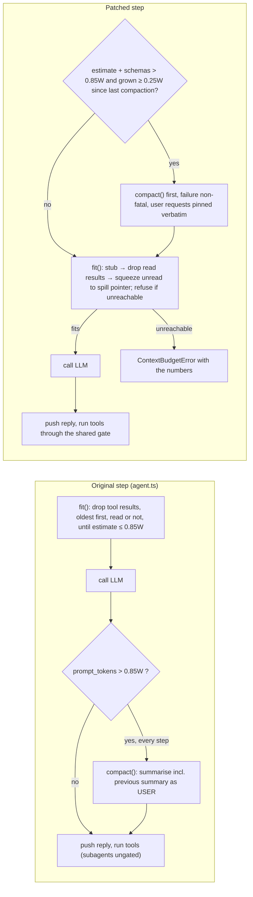

# coding-harness — Architecture Audit, Benchmark against neural-code, and Improvement Plan

| | |
|---|---|
| **Audited revision** | `coding-harness` @ `1e41f4a` (branch `dev`, clean tree) — 25 TypeScript files, 3,568 LOC in `src/` |
| **Reference** | [`avbiswas/neural-code`](https://github.com/avbiswas/neural-code) @ `e3d2b9b` — 17 Python files, ~1,700 LOC |
| **Date** | 2026-10-01 |
| **Companion files** | [`docs/audit/fixes.patch`](audit/fixes.patch) (tested patch for every Phase 1 item), [`docs/audit/tests/`](audit/tests/) (regression tests), [`docs/audit/verification/`](audit/verification/) (the harness that produced every number below) |

---

## 0. Method — what was actually done

Every claim in this report has been checked one of four ways. The evidence IDs in brackets are indexed in [Appendix A](#appendix-a--evidence-index).

1. **Full read** of all 25 source files, the 4 test scripts, the design doc and the reference implementation. Nothing was skimmed or delegated.
2. **Run-log forensics** `[R-*]`: all **45 recorded sessions** in `test/run_*.json` (183 tool calls, 50 `bash` calls). This covers the 100 %-drop incident, an estimator calibration against provider-reported `prompt_tokens`, cache-hit statistics, and shell-failure rates.
3. **Deterministic end-to-end reproduction** `[L-*]`, `[S-*]`, `[I-1]`. A mock LLM replaces `globalThis.fetch`, which the OpenRouter SDK resolves at call time. It emits schema-valid SSE chunks, so the **real** `runAgent` / `runSubagent` / `compact` / tools execute against scripted model behaviour. Nothing leaves the machine. There are 11 loop scenarios and 39 static checks, each run in a throwaway git repo.
4. **Fix-and-re-verify** `[T]`. Every Phase 1 fix was implemented in an isolated copy and the same suites were re-run:
   - Defects reproduced: **34 → 7**. Of the 7, 3 are artefacts of how the check is written and 4 are deliberately deferred.
   - The combined patch passes `git apply --check` on a fresh clone.
   - `tsc` passes, and **126 assertions** pass across 4 test files.

**Not done.** No live API calls were made: they cost money and send data out, and the mock covers the loop logic. The Linux and macOS sandbox branches were exercised by overriding `process.platform` and by reading the code, not by running on those OSes. The "Anthropic models cannot be routed" claim follows from OpenRouter's documented `provider.only` semantics; it was not live-tested.

---

## 1. Executive Summary

### Overall grade: **C−**

The design is good, but under pressure the harness fails silently and destructively, and its security layer only looks like one. `coding-harness` is a faithful TypeScript port of `neural-code` plus a planner/worker/reviewer pipeline, streaming telemetry, a browser tool and Windows awareness. The context-lifecycle design it inherits — cap, strip, fit, a locked prefix, late injection — is sound, and on the happy path it works well: short sessions on the default 64k window get **84–99 % prompt-cache hits**. Most of its serious defects are **port regressions**: guarantees the Python reference had (shared permission gate, subagent `fit()`, non-fatal compaction, working sandbox, safe string substitution) that were lost in translation.

| Area | Grade | One-line justification |
|---|---|---|
| Architecture & design intent | **B+** | Clean module seams, invariants documented in code, allowlist tool sets, cache-aware late injection |
| Context management (`history.ts`) | **D** | Correct when there is room. Under pressure `fit()` blinds the agent and never converges `[R-1][I-1][L-A]` |
| Compaction (`compact.ts`) | **D** | Cascades mid-turn, re-summarises its own summaries, loses the user's words, `$`-corrupts notes `[L-A][L-J]` |
| Subagents & orchestration | **C−** | Context isolation holds. Security isolation does not, and there is no structured verdict or loop bound `[L-C][L-G]` |
| Agent loop & provider interface | **C−** | Good streaming metrics. No step cap, malformed JSON run as `{}`, 429 kills the turn, provider pinned `[L-D][L-E][L-I]` |
| Tools | **C** | Pagination and `mkdir -p` are good. `str_replace` corrupts files; 24 % of `bash` calls fail on Windows `[S-EDIT-1][R-4]` |
| Security (permissions + sandbox) | **F** | Sandbox inert on all three OSes; 13 permission bypasses; subagents skip the gate entirely `[S-PERM][S-SANDBOX][L-C]` |
| Observability & UI | **C+** | Clean panels and TTFT/throughput telemetry, but subagent actions are invisible and 27–53 % of spend goes unreported `[L-A2]` |
| Tests & hygiene | **D−** | `test/` is git-ignored (0 tests tracked); one test is broken, one asserts the unsafe `fit()`/`locked()` contracts, one asserts on dead code |

### Key strengths

- **Prefix caching works by construction within a turn.** Consecutive requests share a byte-identical prefix: 100 % of the previous request minus the reminder `[L-F]`. Across all 45 recorded runs the final-step hit rate is 78.5 %, and 84–99 % on normal multi-step runs `[R-3]`.
- **Improvements over the reference:**
  - Separate `TRIMMED` / `STRIPPED` / `DROPPED` markers make capped results strippable. `neural-code`'s single marker means its 10k-char results are never stripped.
  - `read_file` pagination and `write_file` `mkdir -p`.
  - Per-role tool **allowlists**, where the reference uses a denylist with a typo that leaves `write_file` available to its subagent.
  - Newline-safe permission regexes. The reference's `fnmatch` allows `ls\nrm -rf .`.
- **Token estimation is well calibrated** for the model in use: provider `prompt_tokens ≈ 0.99 × estimate + fixed overhead` (R² = 0.97, n = 37) `[R-2]`.
- **Streaming with real telemetry**: median TTFT 381 ms, median generation 381 tok/s `[R-6]`.
- **Subagent context isolation holds**. Two messages in, one string out, and no recursion: no subagent role is offered `task` or the orchestration tools.

### Highest-priority vulnerabilities

| # | Severity | Finding | Evidence |
|---|---|---|---|
| 1 | **P0** | **Context collapse under pressure.** `fit()` drops results the model has not read and keeps going when the budget is unreachable. Compaction then fires on every step and summarises its own summaries. In a real run this hid **100 % of tool output**, erased the user's "do not touch `src/`" instruction, and the worker wrote into `src/`. | [R-1] [I-1] [L-A] |
| 2 | **P0** | **Subagents bypass the permission engine.** A command the user *denied* in the main agent was re-run by the worker without asking. "Read-only" roles write files via `bash`, and the worker writes outside the project root. | [L-C] |
| 3 | **P0** | **The sandbox is inert everywhere.** `require()` in an ES module means Linux never detects bwrap and silently runs unsandboxed, and **every** `bash` call on macOS throws. Windows has no sandbox but the banner says `sandbox: windows`. | [S-SANDBOX-1..3] |
| 4 | **P0** | **Permission bypasses are unbounded** because nothing sits behind them: output redirection, `$(…)` substitution, `find -delete`, PowerShell `\;`, `env` (prints the API key), and symlink/junction escapes. | [S-PERM] [S-SANDBOX-4] |
| 5 | **P0** | **`str_replace` corrupts files.** `$$`, `$'` and `$&` in `new_str` are expanded by `String.replace`, so Makefiles and shell scripts get the rest of the file spliced in. LF edits also fail on CRLF checkouts (`core.autocrlf=true` here). | [S-EDIT-1/2] |
| 6 | **P0** | **Windows shell mismatch.** The tool is called `bash` and the prompt teaches bash, but it runs PowerShell 5.1. **12 of 50** recorded `bash` calls (24 %) failed for that reason alone. | [R-4] |
| 7 | **P1** | **Provider fragility.** One 429 aborts the turn, 5xx errors are retried silently for up to **1 hour** with no request timeout, mid-stream errors return truncated text as a final answer, and routing is pinned to Together. | [L-I] |
| 8 | **P1** | **A failed compaction kills the turn** and throws away the response that was just paid for. | [L-H] |
| 9 | **P1** | **Spend is under-reported.** Subagent and compaction calls are excluded, hiding 27 % of cost in a normal pipeline run and 53 % in the incident reproduction. | [L-A] [L-A2] |

---

## 2. Feature Health & Working Status Matrix

Status: ✅ **Working** — behaves as advertised · ⚠️ **Fragile** — works on the happy path and fails on reachable edge cases · ❌ **Broken** — fails in normal use or under a demonstrated condition.

| Module | Feature | Status | Observed behaviour | Verification |
|---|---|---|---|---|
| `history.ts` | `cap()` inline cap + spill | ⚠️ | Spill and pointer work. The cut keeps only the head, so a failure printed at the end of a test log is invisible. It also splits UTF-16 surrogate pairs. | S-CAP-1, S-CAP-2; unit test |
| `history.ts` | `spill` / `sweep` scoping | ❌ | One global `SPILLS` array: a subagent's `sweep()` deletes the parent's spill files mid-turn, and the parent then gets `ENOENT`. | L-B |
| `history.ts` | `strip()` at end of turn | ✅ | Idempotent and lands where the design says. It costs one cache rebuild of the previous turn: only 35 % of the prefix is reused at the boundary. | L-F; unit test |
| `history.ts` | `locked()` prefix detection | ⚠️ | Matches any message that *contains* `<summary>`. A C# `/// <summary>` doc comment or an HTML `<details><summary>` freezes every tool result in front of it at full size. Seen in a real run, where an assistant message contained it. | S-LOCK-1/2, R-5 |
| `history.ts` | `fit()` emergency drop | ❌ | Drops **unread** results; has no reachability check, so it destroys everything and still sends an over-budget request; its budget excludes the ~1.4k-token tool schemas; quadratic cost (648 ms at 1,000 messages). | R-1, I-1, S-FIT-1/3, L-A |
| `history.ts` | `estimate()` | ⚠️ | Slope accurate for DeepSeek (0.99), but every caller forgets the fixed overhead, so `fit()` and compaction disagree. | R-2, S-EST-1 |
| `compact.ts` | Trigger (`needed`) and placement | ❌ | Runs *after* each LLM call, mid-turn, with no cooldown: **6 compactions in one user turn** in the reproduction. | L-A |
| `compact.ts` | Handoff note | ❌ | `HANDOFF.replace("{summary}", s)` expands `$$`, `$'` and `$&`. The prior note is rendered to the summariser as `USER:`. The user's own words are never pinned, so they decay per generation. | S-HANDOFF-1, S-RENDER-1, L-J |
| `compact.ts` | `safeBoundary` / `tailStart` | ✅ | Never orphans a tool result. | unit tests |
| `index.ts` | `/compact` | ⚠️ | Works and catches failures, but is a no-op until the transcript exceeds 35 % of the window (`cut <= 1`). | code |
| `agent.ts` | Loop control | ❌ | No step cap: it ran 80 steps until the mock stopped. Truncated tool-call JSON executes with `{}`. A compaction failure rejects the whole turn. | L-E, L-D, L-H |
| `llm.ts` | Streaming + metrics | ✅ | TTFT, generation and end-to-end throughput are correct. Median call 963 ms. | R-6 |
| `llm.ts` | Error handling | ❌ | 429: one attempt, then the turn dies. 5xx: retried for up to 1 h, `timeoutMs: -1`. Mid-stream `error` chunks are ignored. A repeated `function.name` assembles to `bashbashbash`. | L-I |
| `config.ts` | Multi-provider | ❌ | `provider: { only: ["together"], allowFallbacks: false }` is hard-coded, so any model Together does not serve (every Anthropic model) cannot run. There is no `cache_control` (no Anthropic caching) and `reasoning_details` are dropped: 34 runs report reasoning tokens that are discarded. | code, R-6 |
| `context.ts` | Late-injected `<env>` / `<todos>` reminder | ✅ | Never persisted; does not disturb the prefix. | L-F |
| `context.ts` | File-change / staleness notes | ⚠️ | The agent's *own* writes are reported as "changed, read again". The stale note repeats every step until the file is re-read. Runs `git status` and hashes changed files synchronously on every step. | S-CTX-1/2 |
| `todos.ts` | Plan injection | ⚠️ | Works (runs `15-00-54`, `15-02-19`), but todos survive `/clear` (`resetContextState()` is never called) and `status` is not validated. | code |
| `subagent.ts` | Context isolation | ✅ | Two-message start; only the final string returns. | code, L-B |
| `subagent.ts` | Security isolation | ❌ | Calls `tool.execute()` directly, so no `check()` and no approval. "Read-only" roles hold `bash`. | L-C |
| `subagent.ts` | Context management | ❌ | No `fit()`. Requests grew to 32k tokens against a 13.6k budget. | L-G |
| `subagent.ts` | Turn exhaustion / failure | ⚠️ | Returns the last narration ("let me check…"), not a report. An API error escapes as `Tool error:`; files the worker already changed stay changed, with no summary. | code |
| `tools/orchestrator.ts` | Plan → work → review pipeline | ⚠️ | Mechanically works. The verdict is free text that nothing parses except UI colouring (and that colouring matches a *quoted* verdict too). There is no rework bound, though the design doc proposed 2. The reviewer's `git diff` cannot see **untracked** files, i.e. anything new the worker created. Plans are copied into `work_task` arguments, which are never strippable. | code, design doc §7 |
| `tools/task.ts` | `WITHHELD` "structural guarantee" | ❌ dead | Referenced nowhere; `test_subagent.ts` asserts on it. The real guarantee is the allowlist. | grep |
| `tools/bash.ts` | Shell execution | ❌ on Windows | PowerShell 5.1: `&&`, `2>/dev/null`, `ls -la` and `cat -n` fail. A grep with no match (exit 1) reads as `Command failed: …`. ~0.32 s per call through PowerShell vs ~0.13 s through Git Bash. | R-4, S-SHELL-1, L-E |
| `tools/readFile.ts` | Read + pagination | ✅ | Pagination is correct. No size guard and no line numbers. | unit test |
| `tools/writeFile.ts` | Create/overwrite | ✅ | Creates parent dirs. | code |
| `tools/stringReplace.ts` | Exact-match edit | ❌ | `$`-pattern corruption; CRLF mismatch. | S-EDIT-1/2 |
| `tools/writeTodos.ts` | Plan tool | ✅ | Enforces at most one `in_progress`. | code |
| — | `ask_user` | ⛔ absent | No such tool exists. The agent cannot ask a clarifying question mid-turn; in the incident the handoff note said "re-ask the user", and the only way to do that was to end the turn. | grep |
| `tools/browser.ts` | Browser automation | ⚠️ | Works (14 recorded browser runs), but is ungated: `open` takes any URL and `eval` runs arbitrary JS. It is available to the planner and researcher subagents. | code, runs |
| `permissions.ts` | Command rules | ❌ | 13 bypass patterns. False positive on every `2>&1`, so approval prompts fire constantly. | S-PERM, probe |
| `sandbox.ts` | OS sandbox | ❌ | Inert on Linux, breaks `bash` on macOS, none on Windows. The profile dropped `(literal "/dev/null")`. Lexical (non-realpath) containment. | S-SANDBOX-1..4 |
| `recorder.ts` / `--resume` | Persistence | ⚠️ | Writes into the **target project's** `test/`. Saves a snapshot only at the end of a prompt, so a crash mid-turn loses the turn. Records only the last step's usage. Second-resolution filenames. | code |
| `ui.ts` | Panels, spinner, summary | ⚠️ | Looks good. `ui.subagent()` is never called, so subagent tool calls are invisible. Long lines overflow panels; tool output is not ANSI-sanitised; `cache: enabled` is hard-coded. | code |
| `ui.ts` / `index.ts` | REPL input | ❌ | An **empty Enter ends the session**: a following `/help` is never processed. No history, no multiline. | L (REPL probe) |
| `index.ts` | Cost reporting | ❌ | Excludes subagents and compaction. | L-A, L-A2 |
| `test/` | Test suite | ❌ | `.gitignore` contains `test/`, so **0 tests are tracked**. `test_calculator.ts` fails with `ERR_MODULE_NOT_FOUND` (an artefact of the incident). `test_compaction.ts` asserts the unsafe `fit()` (drops the newest result) and `locked()` contracts; `test_subagent.ts` asserts on the dead `WITHHELD` set; `test_orchestration.ts`'s "isolation" test never checks a subagent's tools. | `git ls-files`, T |
| `dist/` | Build output | ⚠️ | 4 orphaned files from older layouts (`dist/tools.js`, `dist/src/index.js`, `dist/calculator/*`). | find |

---

## 3. Root-Cause Analysis — the 100 % Tool-Drop Incident

### 3.1 What happened (`test/run_2026-10-01_17-16-13.json`)

The user asked: *"In a separate folder 'playground/calculator-app', build a standalone TypeScript calculator library … **Do not touch or modify anything in src/.** Follow the full multi-agent pipeline."*

The final transcript is 13 messages long. **Every one of its 5 tool results is `[output dropped: dropped to fit the context window.]`** — `bash`, `read_file`, `write_todos`, `work_task` and `review_task` alike.

| # | Message | What it shows |
|---|---|---|
| 1 | Handoff note, 4,280 chars | It says: *"The user's exact original wording did not survive an earlier compaction; the sentence above is a reconstruction."* So this is at least a second-generation summary, and the constraint is gone. |
| 2 | `work_task` (2,430-char plan) | *"if a `playground/` directory exists, put the app there; **otherwise create `src/calculator/`**."* The constraint lost in #1 becomes a fallback that violates it. |
| 4 | Assistant | *"The worker created `src/calculator/`."* The model never saw the worker's report; this is inference. |
| 12 | Final answer | *"Every tool result in this session comes back to me as `[output dropped…]`. Not just large output — `echo ok`, `ls`…"* |

**Collateral damage, confirmed by timestamps.** `test/test_calculator.ts` was created at 17:15:23 and `dist/calculator/*.js` were compiled from `src/calculator/` at 17:15:27. The run record was saved at 17:16:13. So during this run the worker wrote into the directory the user had placed off-limits. `src/calculator/` has since been deleted, but the compiled output and a now-broken test remain.

### 3.2 The arithmetic `[I-1]`

Replaying the real transcript through the real `fit()`:

- **Non-droppable floor of the final request: 3,127 est. tokens.** That is the system prompt (658) + the handoff note (1,101) + assistant turns *including tool-call arguments* (1,211). Assistant messages and their arguments are never touched by `strip` or `fit` [S-FIT-2].
- With any `CONTEXT_WINDOW` below about **3,700**, the budget `0.85 × W` is below that floor. `fit()` replaces the fresh `read_file` result and **still** returns an over-budget transcript.
- The floor plus the **1,412-token tool schemas** (which `estimate()` never counts) gives ≈ 4,540. The provider reported **4,542** prompt tokens for that request.
- `cached_tokens` was **2,176**, roughly the system prompt plus schemas rounded to 128-token blocks. Everything after the system prompt was re-prefilled, because the previous step had regenerated the summary. The run's cache hit rate was 48 %, against 84–99 % normally `[R-3]`.

### 3.3 Causal chain — five defects that compound

1. **`fit()` does not distinguish read from unread results** ([`history.ts:158-179`](../src/history.ts#L158-L179)). It walks from the lock point and drops *every* tool message until the estimate fits, including the results of the step the model is about to read. The model sees `[output dropped]` for `echo ok`, re-runs it, and the new result is dropped too. The turn cannot converge.
2. **`fit()` has no reachability check.** When the floor exceeds the budget it destroys all tool output and sends the over-budget request anyway. The provider accepted it, because the real model window is far larger than the artificial `CONTEXT_WINDOW`. The harness blinded itself to meet a limit nobody else enforced.
3. **The budget ignores fixed overhead.** `fit()` compares `estimate(messages)` (no schemas, no reminder) with `0.85 W`, while compaction compares provider `prompt_tokens` (with schemas) with the same `0.85 W`. With ~1.4k tokens of schemas, the two mechanisms disagree about whether a request fits, and in small windows the disagreement is the whole budget.
4. **Compaction moved into the step loop, after the call, with no cooldown** ([`agent.ts:104-110`](../src/agent.ts#L104-L110)). `neural-code` compacts once, between turns. Here, once `prompt_tokens` passes the threshold, compaction runs on **every step**. Each run summarises the previous handoff note, which [`render()`](../src/compact.ts#L81-L105) labels `USER:`. Reproduction: **6 compactions in one user turn**; after the first, no summariser input contains the user's words `[L-A]`.
5. **The user's words are never pinned.** "Quote them where the exact wording matters" is a soft instruction to a summariser that, from generation 2 on, never sees the original. The constraint decays, the next plan inverts it, and the worker acts on the inversion.

`fit()` runs **before** compaction in every step (`agent.ts:75` vs `:104`), so the "last resort" destroys tool output *before* the summariser can read it. In practice it is the first resort.



### 3.4 Safeguards — the fail-safe contract (implemented and tested in §6.1–6.3)

| Invariant | Mechanism | Verified |
|---|---|---|
| **I1. Never blind.** A result the model has not read is never replaced by nothing. | `live()` marks the newest step's results; they can only be **squeezed** to ~1k chars plus a pointer to the full text on disk. | unit `testFit`; L-A2 |
| **I2. Price before cutting.** If the deepest cut cannot reach the budget, change nothing. | `fit()` computes `floor` first and returns `{fits:false, floor}` untouched. The loop raises `ContextBudgetError` with the numbers. | S-FIT-1; L-A |
| **I3. Graduated degradation.** | Stub read results → drop read results → squeeze unread results, each pass only while over budget. | unit `testFit` |
| **I4. One budget.** | `overhead()` = tool schemas + 300-token reminder reserve, added on every check. `budgetWarning()` flags configurations where the fixed cost exceeds half the budget. | L-A message |
| **I5. Summarise before dropping.** | Compaction runs *before* the request; `fit()` runs after it. | L-H |
| **I6. No cascades.** | At most one compaction per 0.25 W of growth. | L-A: 6 → 0 compactions |
| **I7. The user's words are not summarised.** | `pinned()` copies every user request verbatim into `<request>` blocks that carry through every later compaction (6k-char budget, first request always kept). | L-J: survives 3 generations |
| **I8. Compaction failure is not fatal.** | Wrapped; the loop continues into `fit()`. | L-H: turn completes |
| **I9. O(n).** | Per-message sizes computed once. | S-FIT-3: 648 ms → 2 ms |

**Before/after on the same scenarios:**

| Scenario | Original | Patched |
|---|---|---|
| L-A: incident shape, `CONTEXT_WINDOW=3500` | 6 compactions in one turn; 5/7 results reached the model as `[output dropped]`; user constraint erased; reported cost $0.0008 vs $0.0017 billed | Stops at step 2: `ContextBudgetError: This request needs ~3006 tokens even with every old tool result dropped, but the budget is 2975 (… ~1716 of it tool schemas). Raise CONTEXT_WINDOW or run /compact.` 0 results blinded, 0 compactions |
| L-A2: same, `CONTEXT_WINDOW=6000` | Completes; reported $0.0008 vs $0.0011 billed | Completes; reported $0.0011 vs $0.0011 billed |
| L-H: compaction returns HTTP 400 | Turn rejected; the paid response is discarded | Note logged, 2 old results stubbed, turn completes and its tool runs |
| L-J: 3 successive compactions | Summary `$`-mangled; user's constraint gone; prior note labelled `USER:`; cost not reported | Summary verbatim; constraint verbatim after 3 generations; labelled `EARLIER HANDOFF NOTE:`; cost returned |
| L-G: subagent, 15 reads of 9 kB | Request grows to 32,365 tokens against a 13,600 budget | Plateaus at 12,968 |

> **About `CONTEXT_WINDOW` as a test knob.** Lowering it to force compaction makes the fixed overhead (system prompt + schemas ≈ 2.1k tokens) a large share of the budget. The patched build refuses to run blind in that regime and says why. `budgetWarning()` should be wired into start-up (§6.7) so this is caught before the first prompt rather than at step 2.

---

## 4. Comparative Analysis with `neural-code`

### 4.1 Lineage

`neural-code` is a 15-stage tutorial harness: chat → tools → loop → UI → skills → edit tools → env injection → freshness reminders → sessions/rewind → todos → permissions → sandbox → compaction → subagents. `coding-harness` ports it module for module, often docstring for docstring (`history.ts`'s header is a verbatim translation; the seatbelt profile is still written to `neuralcode.sb`). On top of the port it adds the planner/worker/reviewer pipeline, a browser tool, streaming with telemetry, `read_file` pagination, three-marker output lifecycle, and Windows rules.

### 4.2 Dimension-by-dimension

| Dimension | `neural-code` (reference) | `coding-harness` (current) | Gap / divergence |
|---|---|---|---|
| **Prefix caching** | Late-injected reminder, never persisted. `locked()` = system + newest summary. `strip` at turn end. **Compaction only between turns**, so at most one prefix rebuild per compaction. No `cache_control`. | Same late injection: byte-identical prefix across steps [L-F]. Same `locked()`. **Compaction inside the step loop**, so the prefix can be rebuilt every step (incident: only system + schemas cached). No `cache_control`, banner claims `cache: enabled`. | **Regression:** mid-turn compaction without cooldown. **Shared:** `locked()` substring match [S-LOCK]; no Anthropic breakpoints; `strip` costs one rebuild per turn boundary (35 % reuse) [L-F]. |
| **Tool lifecycle** | `cap` (10k, head) → `strip` (300) → `fit` (drop), with **one marker** for all three. `strip` skips anything with the marker, so **capped 10k results are never stripped and never dropped**. | Same three stages with **three markers**: capped results *are* stripped at turn end (improvement). `cap` is applied in the loop to every tool, subagent reports included. Single global spill list. | **Improvement:** markers. **Shared:** `fit` drops unread results; head-only cap; O(n²) `fit`; tool-call arguments never reducible. **Regression:** global spill list lets subagents delete the parent's files [L-B]. |
| **Compaction strategy** | Same prompt (Goal / What happened / Files / State / Next), tail 0.35 W, trigger 0.85 W of last `prompt_tokens`. **Wrapped in try/except** ("the worst moment to lose the session over a rate limit"). `HANDOFF.format()` is `$`-safe. | Identical prompt and ratios. Runs **after** the LLM call, **before** the reply is pushed. **Not wrapped:** failure aborts the turn and discards the paid reply [L-H]. `String.replace` corrupts `$$`/`$'`/`$&` [S-HANDOFF-1]. | **Regressions:** placement, error handling, substitution. **Shared:** prior summary rendered as `USER:`; user requests not pinned. |
| **Subagent protocol** | 2-message start. Uses the **same `execute()`** as the main loop ("a subagent is a second caller, not a privileged one"), so the same permission rules and approval prompts apply. `fit()` every turn. **Denylist** `WITHHELD = {"task","write_todos","str_replace","write"}` — the typo `"write"` leaves `write_file` available. Nested tool display, 150-word report budget, `MAX_TURNS=12`. | 2-message start; **allowlist** per role (better), plus planner/worker/reviewer roles. Own loop calls `tool.execute()` directly: **no `check()`, no approvals** [L-C]. **No `fit()`** [L-G]. `sweep()` hits the parent's spills [L-B]. `WITHHELD` retained as dead code. Subagent tool calls not displayed. | **Major regression in containment.** Improvement in role design and allowlisting. |
| **Tool calling model** | Native OpenAI-style tool calls, **non-streaming**, OpenAI SDK (built-in retries on 408/409/429/5xx), any `BASE_URL`. | Native tool calls, **streamed** deltas assembled by `index`. OpenRouter SDK: 5xx-only retries for up to 1 h, **no 429 retry**, no timeout. Provider pinned to Together. Neither project uses text tags. | Streaming + metrics is an improvement. Retry semantics and provider flexibility regressed. |
| **Robustness & edge cases** | `execute()`: invalid JSON, unknown tool, wrong arguments and timeouts all come back as readable errors, without running anything. Sessions are **JSONL appended after every message** (crash-safe), the loader tolerates a half-written line, `/rewind` and `/sessions` exist. | Invalid JSON **runs with `{}`** [L-D]. Unknown tool → error. Snapshot saved only at end of prompt, into the target project's `test/`. No `/rewind`, no `/sessions`. No signal handling. | **Regression** in persistence and argument validation. **Shared:** no step cap; empty Enter exits. |
| **Permissions** | `rm`/`sudo`/`chmod`/`curl`/`wget`/`git push\|reset\|clean` → **deny** ("never, even if the user says yes"). `fnmatch` patterns compile to `(?s:…)`, so `ls\nrm -rf .` is **allowed**. Real containment is delegated to the kernel sandbox. | Same commands downgraded to **ask**. Anchored regex without `s`, so the newline bypass is **closed**. Adds Windows rules and asks on `read_file` outside the project. But the sandbox behind it is inert, so every bypass is unbounded. | Mixed: one hole closed, the safety net removed. |
| **Sandbox** | Works on macOS (seatbelt; `/dev/null` writable) and Linux (`shutil.which("bwrap")`); reports `none` on Windows. | `require()` in ESM: Linux never sandboxes, macOS `bash` always throws. Profile dropped `/dev/null`. Reports `windows` on Windows with no sandbox. | **Regression.** |
| **Input & UI** | `prompt_toolkit`: history, multiline (opt-enter), word jumps. `rich` panels. | `readline` recreated per prompt, hand-rolled panels without wrapping, no streaming display. | Regression in input; parity in panels. |
| **Tests** | None. | 4 ad-hoc scripts, untracked, 1 broken. | Intent improved; execution did not. |

### 4.3 What `neural-code` does better

1. **One gate for every caller.** `tools.execute()` validates JSON, resolves the tool, applies permissions and approvals, and maps every exception to a readable result, for the main loop and subagents alike. This is the single most valuable idea the port dropped.
2. **Compaction between turns, failure-tolerant.** It never compacts twice in one turn and never loses a turn to a rate limit.
3. **Crash-safe, append-only sessions** outside the project directory, with rewind and compaction records.
4. **A sandbox that actually runs**, with the small detail that matters (`/dev/null`).
5. **Concise subagent reports by contract** ("aim for under 150 words … cite the path and line").

### 4.4 What `coding-harness` improved

1. **Three-marker lifecycle.** Capped results stop being permanent 10k-char residents.
2. **Allowlists instead of a typo-prone denylist** for subagent tools.
3. **Newline-safe permission matching**, which closes a hole the reference has.
4. **Streaming telemetry**: TTFT, generation and end-to-end throughput, cost details.
5. **Pagination, `mkdir -p`, skills reload, case-insensitive skill lookup**, and Windows-aware permission rules.
6. **Role-specialised subagents** with a documented design (`docs/multi_agent_orchestration_plan.md`).

### 4.5 Port regressions (where `coding-harness` fell short of its own reference)

| Reference guarantee | What the port did | Evidence |
|---|---|---|
| Subagents call the shared `execute()` | Calls `tool.execute()` directly | L-C |
| Subagents `fit()` every turn | Removed | L-G |
| Spills swept once, by the turn owner | `sweep()` added to the subagent's `finally` over a global list | L-B |
| `shutil.which("bwrap")` | `require("node:child_process")` in an ES module | S-SANDBOX-1/2 |
| Seatbelt allows `/dev/null` | Rule dropped | code |
| Auto-compaction wrapped in try/except | Not wrapped | L-H |
| Compaction between turns | Moved into the step loop, after the call | L-A |
| `HANDOFF.format()` / Python `str.replace` | JS `String.replace` with string replacements (`$` patterns) | S-HANDOFF-1, S-EDIT-1 |
| Invalid JSON → error, nothing run | `{}` and run | L-D |
| JSONL sessions, `/rewind`, `/sessions` | Snapshot into `./test/` | code |
| `prompt_toolkit` input | `readline` per prompt | code |

### 4.6 Defects inherited from the reference (shared)

- `locked()` substring match [S-LOCK].
- `fit()` drops unread results and has no reachability check [I-1].
- No step cap [L-E].
- File-change notes flag the agent's own edits [S-CTX-1].
- `split_command` breaks `2>&1` into a bare `1`, so every such command asks.
- Empty Enter exits.
- Head-only `cap`.
- Prior summary rendered as `USER:`.
- Tool-call arguments never reducible.

### 4.7 Architectural takeaways

1. **Invariants need owners and tests.** Every regression in §4.5 removed a guarantee whose only record was a sentence in a docstring or a line in the reference. Each Phase 1 fix therefore comes with a regression test.
2. **Isolation has two axes.** "Nothing goes in, only the answer comes back" is *context* isolation, and it holds. *Authority* isolation — a subagent gets no more power than its caller — needs the shared gate, which the patch restores and extends: read-only roles cannot even ask.
3. **Fail loud, not lossy.** A silent, lossy degradation (dropping the model's eyes) is worse than a loud stop that names the misconfiguration.
4. **Summaries are lossy codecs. Do not chain them on the user's words.** Pin user input verbatim, and summarise only the agent's own work.

### 4.8 Economic & latency feasibility

| Metric | Value | Source |
|---|---|---|
| Recorded spend, 45 runs (main loop only) | $0.088 total; median $0.00078/run; p90 $0.0047; max $0.0213 (Wordle, 102 messages) | R-6 |
| Cost per assistant step | median $0.00025, p90 $0.00080 | R-6 |
| Final-step cache hit rate | 78.5 % overall (82,432 / 105,062 tokens); 84–99 % on multi-step runs; **48 %** in the compaction-cascade run; 54 % in a run whose last step added a large plan | R-3 |
| Hidden spend (subagents + compaction) | 27 % (L-A2 pipeline) to 53 % (L-A incident) of the true cost | L-A, L-A2 |
| Fixed overhead per request | ~1,412 tokens of tool schemas (11 tools) + 549–658 tokens of system prompt. That is ~3 % of a 64k window and ~60 % of a 3.5k one. | S-EST-1 |
| Per-call latency | median TTFT 381 ms (p90 495 ms); median call 963 ms; 381 tok/s | R-6 |
| Shell overhead (Windows) | 60 trivial commands: **19.3 s via PowerShell vs 8.0 s via Git Bash** (~0.19 s per call saved) | L-E |
| Pipeline latency bound | plan (≤10) + work (≤20) + review (≤8) = up to 38 sequential subagent calls plus main-loop calls, i.e. roughly 1–3 minutes of LLM time per pass before tool time, with no parallelism | code + R-6 |
| Plan duplication | The planner's report lands in the parent as a tool result, then is **re-emitted as `work_task` arguments**. That costs output tokens (several times the input price) and leaves a permanent, unstrippable assistant message (2.4k chars in the incident). | R-1, S-FIT-2 |

Subagents are **cheap in tokens but expensive in latency**. Their prefixes (system prompt + schemas) cache well across calls, since DeepSeek through Together caches in 128-token blocks, but every turn is a full sequential round trip. The economics favour fewer, larger subagent turns ("search in batches", as the reference's prompt says) and passing plans by reference.

---

## 5. Concrete Proposals & Recommendations

Effort: **S** < 2 h · **M** ≈ ½ day · **L** 1–2 days. Every Phase 1 item is **implemented in [`docs/audit/fixes.patch`](audit/fixes.patch)**, applies cleanly, and is covered by the tests in [`docs/audit/tests/`](audit/tests/).

### Phase 1 — Immediate critical fixes (P0)

| ID | Problem | Fix (in the patch) | Files | Effort | Verified by |
|---|---|---|---|---|---|
| P0-1 | `fit()` blinds the agent and never converges | Fail-safe `fit()`: protect unread results; price the floor first; stub → drop → squeeze-to-pointer; O(n); returns `{fits, floor, …}` | `history.ts` | M | S-FIT-1/3, I-1, `testFit` |
| P0-2 | Compaction cascade, after-call placement, fatal failures | Compaction **before** the call; 0.25 W growth cooldown; overhead-aware budget; failure is non-fatal; `ContextBudgetError` with numbers; `budgetWarning()` | `agent.ts` | M | L-A, L-H |
| P0-3 | Handoff loses the user's words; `$` corruption; mislabelled prior note | `pinned()` verbatim requests carried through every compaction; single-pass replacer; `EARLIER HANDOFF NOTE:` label; live results protected; returns cost | `compact.ts` | M | L-J, `testRenderAndPinning` |
| P0-4 | `locked()` matches `<summary>` anywhere | Match only a **user** message that **starts with** the handoff opening (backward compatible with saved transcripts) | `history.ts` | S | S-LOCK-1/2 |
| P0-5 | Subagents bypass permissions; cross-scope sweeps; unbounded context | New shared gate `execute.ts`, used by both loops. The approver propagates via `AsyncLocalStorage`. Planner and researcher are `readOnly` (an "ask" becomes a refusal). Each subagent has its own `SpillScope` and calls `fit()` every turn. Nested tool display. Forced final report when out of turns. | `execute.ts` (new), `agent.ts`, `subagent.ts`, `tools/orchestrator.ts`, `tools/task.ts` | M | L-B, L-C, L-G, `testExecuteGate` |
| P0-6 | Malformed tool JSON runs with `{}`; no step cap | Readable error and nothing runs; `MAX_STEPS` (default 60) | `execute.ts`, `agent.ts`, `config.ts` | S | L-D, L-E |
| P0-7 | Sandbox inert | ESM imports; `command -v bwrap`; `(literal "/dev/null")`; read-only `.git` under bwrap; realpath containment; `none` on Windows; non-zero exit and runaway output surfaced; API key scrubbed from the child environment | `sandbox.ts` | M | S-SANDBOX-1..4, `testSandboxSource`, `testPaths` |
| P0-8 | Permission bypasses and approval fatigue | Quote-aware `effects()` scan: redirect targets (except `/dev/null`, `$null`, `nul`), `$( )`/backticks (including inside `"…"`), process substitution, newlines, credential paths. `RISKY_FLAGS` for `find -delete/-exec`, `git branch -D/-m`, `--output`, `sort -o`, env dumps. `env` removed from the allowlist. Shell-aware escaping (PowerShell's escape is the backtick). `2>&1` no longer splits. | `permissions.ts` | M | S-PERM, `testShellEscalation`, `testReadOnlyStillFlows` |
| P0-9 | `str_replace` corruption and CRLF | Replacer function / `split().join()`; LF→CRLF retry | `tools/stringReplace.ts` | S | S-EDIT-1/2, `testStringReplace` |
| P0-10 | Windows: tool says bash, shell is PowerShell | Use Git for Windows' `bash.exe` when present (`BASH_PATH` override). Otherwise the tool description states PowerShell 5.1 rules. Exit codes reported as `[exit code N]`. | `sandbox.ts`, `tools/bash.ts` | S | S-SHELL-1 |
| P0-11 | Provider errors | 429 + 5xx with bounded backoff (180 s; SDK honours `Retry-After`); idle-stream watchdog (90 s, `STALL_MS`); mid-stream `error` / `finish_reason=error` surfaced; name-repeat fix; `ledger` of all calls | `llm.ts` | S | L-I |
| P0-12 | Cost under-reported | `totalCost` = ledger delta (main + subagents + compaction) | `agent.ts`, `llm.ts` | S | L-A2 |
| P0-13 | Provider pinned to Together | `PROVIDER_ONLY` env var; unset = OpenRouter default routing | `config.ts` | S | code |
| P0-14 | Tests untracked and asserting bugs | Move tests out of the ignored `test/` (e.g. `tests/`), adopt the updated `test_compaction.ts` + new `test_security.ts`, delete `test_calculator.ts`, add `"test"` to `package.json` | repo | S | T: 126 assertions |

### Phase 2 — Architectural improvements (P1)

**Subagent coordination**

1. **Structured review verdict.** Give the reviewer a `submit_review` tool with schema `{verdict: "approved" | "changes_requested", issues: [{file, line, problem, fix}]}`. The orchestrator tool returns a compact rendering, and the rework loop is **bounded in code** (max 2 cycles, as the design doc's §7.2 proposed). Today the verdict is free text, the UI's `includes("VERDICT: APPROVED")` also matches a quoted verdict, and the loop is unbounded. (M)
2. **Plans by reference.** Store planner output under `.agents/artifacts/plan-<id>.md` and have `work_task` / `review_task` take `plan_id`. This removes the re-emitted copy (output tokens) and the unstrippable 2.4k-char assistant arguments. (M)
3. **A review baseline the reviewer can see.** Snapshot before `work_task` (`git stash create` or `git write-tree`) and have the reviewer diff against it with untracked files included (`git add -N` / `git diff --no-index`). Today, new files the worker creates are invisible to `git diff`. (S)
4. **Failure semantics.** Catch errors inside `runSubagent` and return a partial report plus `git status --short` of what changed. Add a wall-clock timeout per subagent (thread an `AbortSignal` through `callLLM`). (M)
5. **Enforce orchestrator mode.** When the pipeline is requested, offer the main agent only `plan/work/review/task/write_todos` plus read-only `bash`, matching the design doc's table. Resolve the contradictory system prompt ("Your job is to code. Always code." vs "coordinate specialized subagents"). (S)

**Prompt caching**

6. **Cache-break telemetry.** Hash each request's serialised prefix, log the first divergent message index and the reason (strip, compaction, other), and show cache-hit % per turn instead of the hard-coded `cache: enabled`. (M)
7. **Anthropic breakpoints.** When `MODEL` starts with `anthropic/`, send content blocks with `cache_control: {type: "ephemeral"}` on the system prompt, the tools, and the last message of the locked prefix. (M)
8. **Make strip pay for itself.** Stripping costs one re-prefill of the previous turn (35 % prefix reuse at the boundary). With cached input billed at a fraction of fresh input, stripping a 400-char result is a net loss. Strip only results above a threshold, or only once the transcript passes ~25 % of the window. (S)
9. **Elide tool-call arguments at turn end.** Replace `write_file.content` and large `str_replace` bodies with `[content elided: 12,345 chars written to x.ts]`; this has the same cache semantics as strip and closes S-FIT-2. (S)

**Error recovery and state**

10. **Crash-safe sessions** following the reference's `session.py`: append-only JSONL in `~/.agents/sessions/<project>/`, rewind and compaction records, `/sessions`, `/rewind`. Stop writing transcripts into the target project. (L)
11. **Ctrl+C cancels the turn, not the process.** Use a per-turn `AbortController`. Pending tool calls get `[cancelled by user]` results so the transcript stays valid. A second Ctrl+C exits through a cleanup handler (sweep, close the browser, save). (M)
12. **Round-trip `reasoning_details`** for providers that require them during tool loops. (S)
13. **`context.ts` hygiene.** Exclude the agent's own writes from change notes (hash after write), show a stale note once per change, run `git status` asynchronously with a timeout, skip hashing files over 1 MB, and call `resetContextState()` on `/clear`. (S)
14. **Gate the browser.** Ask before `open` to non-allowlisted hosts and before any `eval`. Withhold the browser from the planner by default. (S)

### Phase 3 — DX & feature enhancements (P2)

15. **Input.** Empty Enter must not exit; use Ctrl+D or `/exit`. Add history and multiline input. Render streamed tokens: `onChunk` is already plumbed through `runAgent` but unused. (S–M)
16. **Visibility.**
    - Nested subagent tool panels (in the patch) plus a per-subagent tokens/cost line.
    - Wrap long panel lines, show write arguments as `path (N chars)`, and strip ANSI/OSC sequences from tool output before printing.
    - Wire `onNote` into the UI (§6.7). (S)
17. **Telemetry in the run record.**
    - Per-step usage; today only the last step is saved.
    - Cache-hit % and compaction events.
    - Cost by role: main, planner, worker, reviewer, researcher, compaction. (S)
18. **Tools.**
    - `ask_user` for clarifying questions mid-turn.
    - Portable `grep`/`glob` tools that do not depend on the shell.
    - Line numbers in `read_file`.
    - Size guard for huge or binary files.
    - Bare `head` / `tail` allowed at the end of a pipe (today `| head` asks, because the rule is `"head *"`). (M)
19. **Engineering.**
    - `npm test` with `node:test`, and CI running `tsc` + tests on Linux, macOS and Windows.
    - ESLint with `no-restricted-globals: require`.
    - Delete dead code: `WITHHELD`, `SUBAGENT_TOOL_SCHEMAS`, `getTodos`, `ui.pick`/`ui.clear`, unused `ANSI_DIM` and `config` imports.
    - Clean `dist/` before build; remove `hello.txt` and `wordle_words.txt` from the repo root.
    - Let `/compact` force a compaction below 35 % of the window. (M)

---

## 6. Reference Code Diffs

The diffs below are the complete per-file contents of [`docs/audit/fixes.patch`](audit/fixes.patch) (13 files, +812 / −252). It was generated against `1e41f4a`, and applied to a fresh clone it type-checks and passes all four test files:

```bash
git apply docs/audit/fixes.patch
```

```bash
npx tsc --noEmit
```

```bash
npx tsx tests/test_compaction.ts
```

```bash
npx tsx tests/test_security.ts
```

Copy `docs/audit/tests/*.ts` into the tests directory first; they import `../src/…`. The original `test_compaction.ts` asserts the old, unsafe `fit()` contract and the old `locked()` format, so it must be replaced by the updated version.

### 6.1 Fail-safe context budget — `src/history.ts` (P0-1, P0-4; plus head+tail cap and spill scopes)

Highlights:
- `live()` protects unread results.
- `fit()` prices the floor before cutting and degrades stub → drop → squeeze, never to nothing.
- `locked()` matches only the real handoff note.
- `SpillScope` lets each run sweep only its own files.
- `cap()` keeps the tail and never splits a surrogate pair.

<details><summary>Show diff — <code>src/history.ts</code></summary>

```diff
diff --git a/src/history.ts b/src/history.ts
index f447f6d..9276d9d 100644
--- a/src/history.ts
+++ b/src/history.ts
@@ -9,11 +9,14 @@
  * 2. strip  - once a turn is over, its tool results shrink to a stub. The edit
  *             lands at the tail, right before the next user message, so the
  *             cached prefix in front of it survives.
- * 3. drop   - a single request is still too big. Throw tool results away whole,
- *             oldest first, until it fits.
+ * 3. fit    - a single request is still too big. Shrink what the model has
+ *             already read - stub it, then drop it, oldest first - and only then
+ *             squeeze the newest results down to a pointer at their spill file.
+ *             A result the model has not read is never replaced by nothing, and
+ *             when the budget is out of reach fit() changes nothing at all.
  *
  * Everything here refuses to touch the locked prefix - the frozen
- * system + summary + head that compaction leaves behind. That block has to stay
+ * system + summary that compaction leaves behind. That block has to stay
  * byte-identical to stay cached.
  */
 
@@ -25,122 +28,172 @@ import { config } from "./config.js";
 
 export const CAP = config.toolCap || 10_000;
 export const STUB = config.toolStub || 300;
+const SQUEEZE = 1_000; // chars of an unread result kept inline when even that is too much
 
 export const TRIMMED = "[output trimmed:";
 export const STRIPPED = "[output stripped:";
 export const DROPPED = "[output dropped:";
 export const SUMMARY = "<summary>";
 
-export const SPILLS: string[] = [];
+/** Compaction's handoff note always opens with exactly this. */
+export const HANDOFF_OPENING = `${SUMMARY}\nEverything before this point has been compacted`;
+
+const DROPPED_NOTE = `${DROPPED} dropped to fit the context window.]`;
+
+/**
+ * Temp files owned by one agent run. Each run sweeps only its own, so a
+ * subagent finishing cannot delete a file its parent was told to page through.
+ */
+export type SpillScope = string[];
+
+/** The main agent's current turn. Subagents bring their own scope. */
+export const SPILLS: SpillScope = [];
+
+function text(message: ChatMessages): string {
+  const raw = (message as any)?.content;
+  return typeof raw === "string" ? raw : "";
+}
 
 // ------------------------------------------------------------------- 1. cap
 
 /**
  * Park the full output on disk for the rest of this turn.
  */
-export function spill(text: string): string {
-  const tmpDir = os.tmpdir();
+export function spill(text: string, scope: SpillScope = SPILLS): string {
   const fileName = `customharness-tool-${Date.now()}-${Math.random().toString(36).slice(2, 8)}.txt`;
-  const filePath = path.join(tmpDir, fileName);
+  const filePath = path.join(os.tmpdir(), fileName);
   fs.writeFileSync(filePath, text, "utf-8");
-  SPILLS.push(filePath);
+  scope.push(filePath);
   return filePath;
 }
 
+/** Move a cut point off the middle of a surrogate pair. */
+function boundary(text: string, index: number): number {
+  const code = text.charCodeAt(index - 1);
+  return code >= 0xd800 && code <= 0xdbff ? index - 1 : index;
+}
+
 /**
  * Trim a fresh tool result, leaving a pointer to the whole thing.
+ *
+ * Keeps the head and the tail: compilers and test runners print the verdict
+ * last, so a head-only cut hides exactly the line the agent needs.
  */
-export function cap(text: string): string {
-  const limit = config.toolCap || 10_000;
+export function cap(
+  text: string,
+  scope: SpillScope = SPILLS,
+  limit: number = config.toolCap || 10_000,
+  parked?: string
+): string {
   if (text.length <= limit) {
     return text;
   }
 
+  const headEnd = boundary(text, Math.floor(limit * 0.7));
+  const tailStart = boundary(text, text.length - (limit - headEnd));
+  let pointer: string;
   try {
-    const filePath = spill(text);
-    const cut = text.length - limit;
-    return (
-      text.slice(0, limit) +
-      `\n\n${TRIMMED} ${cut} of ${text.length} chars cut. ` +
+    const filePath = parked ?? spill(text, scope);
+    pointer =
       `The whole output is at ${filePath} - page through it with ` +
-      `head, tail, or read_file. It is deleted when this turn ends.]`
-    );
+      `head, tail, or read_file. It is deleted when this turn ends.`;
   } catch {
-    const cut = text.length - limit;
-    return (
-      text.slice(0, limit) +
-      `\n\n${TRIMMED} ${cut} chars cut and the rest could not be saved.]`
-    );
+    pointer = "The rest could not be saved.";
   }
+  return (
+    text.slice(0, headEnd) +
+    `\n\n${TRIMMED} ${tailStart - headEnd} of ${text.length} chars cut from the middle. ${pointer}]\n\n` +
+    text.slice(tailStart)
+  );
 }
 
 /**
- * Delete this turn's temp files. Their paths die with the tool results.
+ * Delete one run's temp files. Their paths die with the tool results.
  */
-export function sweep(): void {
-  for (const filePath of SPILLS) {
+export function sweep(scope: SpillScope = SPILLS): void {
+  for (const filePath of scope) {
     try {
-      if (fs.existsSync(filePath)) {
-        fs.unlinkSync(filePath);
-      }
+      fs.rmSync(filePath, { force: true });
     } catch {
       // Ignore cleanup error
     }
   }
-  SPILLS.length = 0;
+  scope.length = 0;
 }
 
 /**
  * Length of the frozen prefix - everything up to and including the newest
  * summary. Derived rather than remembered, so it stays correct across
- * /compact, /rewind and switching sessions.
+ * /compact and --resume.
+ *
+ * Only compaction's own note counts. A C# doc comment or an HTML <details>
+ * block in a tool result contains "<summary>" too, and treating that as the
+ * lock froze every tool result in front of it at full size.
  */
 export function locked(messages: ChatMessages[]): number {
   for (let index = messages.length - 1; index >= 0; index--) {
-    const raw = (messages[index] as any)?.content;
-    const content = typeof raw === "string" ? raw : "";
-    if (content.includes(SUMMARY)) {
+    if (messages[index].role === "user" && text(messages[index]).startsWith(HANDOFF_OPENING)) {
       return index + 1;
     }
   }
   return 0;
 }
 
+/**
+ * Where the newest step's tool results begin. The model has not read these
+ * yet: replace one with a marker and it re-runs the command, the new result
+ * is dropped too, and the turn never converges.
+ */
+export function live(messages: ChatMessages[]): number {
+  let index = messages.length;
+  while (index > 0 && messages[index - 1].role === "tool") {
+    index--;
+  }
+  return index;
+}
+
 // ----------------------------------------------------------------- 2. strip
 
+function stub(content: string): string {
+  const stubLimit = config.toolStub || 300;
+  return (
+    content.slice(0, stubLimit) +
+    `\n\n${STRIPPED} ${content.length - stubLimit} more chars. ` +
+    `Run the command again if you need them.]`
+  );
+}
+
 /**
  * Shrink every tool result that is no longer part of the live turn.
  *
  * Called once a turn has finished, so by now "everything unlocked" and
- * "everything the model no longer needs in full" are the same set.
+ * "everything the model no longer needs in full" are the same set. Mid-turn
+ * callers pass protectLive so the results the model is about to read survive.
  */
-export function strip(messages: ChatMessages[]): number {
+export function strip(messages: ChatMessages[], protectLive = false): number {
   const stubLimit = config.toolStub || 300;
+  const end = protectLive ? live(messages) : messages.length;
   let shrunk = 0;
-  const lockIndex = locked(messages);
 
-  for (let index = lockIndex; index < messages.length; index++) {
+  for (let index = locked(messages); index < end; index++) {
     const message = messages[index] as any;
-    const raw = message?.content;
-    const content = typeof raw === "string" ? raw : "";
-    if (message.role !== "tool" || content.includes(STRIPPED) || content.length <= stubLimit) {
+    const content = text(message);
+    if (message.role !== "tool" || content.includes(STRIPPED) || content.includes(DROPPED) || content.length <= stubLimit) {
       continue;
     }
-
-    message.content =
-      content.slice(0, stubLimit) +
-      `\n\n${STRIPPED} ${content.length - stubLimit} more chars. ` +
-      `Run the command again if you need them.]`;
+    message.content = stub(content);
     shrunk++;
   }
 
   return shrunk;
 }
 
-// ------------------------------------------------------------------ 3. drop
+// ------------------------------------------------------------------ 3. fit
 
 /**
- * Rough token count. Good enough to decide whether to panic.
+ * Rough token count. Calibrated against 37 recorded runs: provider-reported
+ * prompt_tokens ~= 0.99 x this + the fixed overhead it does not see (tool
+ * schemas, reminder) - so callers must add that overhead themselves.
  */
 export function estimate(messages: ChatMessages[]): number {
   let totalChars = 0;
@@ -150,30 +203,100 @@ export function estimate(messages: ChatMessages[]): number {
   return Math.floor(totalChars / 4);
 }
 
+/** Re-cap an unread result to SQUEEZE chars, reusing its spill file if it has one. */
+function squeeze(content: string, scope: SpillScope): string {
+  const parked = content.match(/The whole output is at (.+?) - page through it/)?.[1];
+  if (parked && fs.existsSync(parked)) {
+    return cap(fs.readFileSync(parked, "utf-8"), scope, SQUEEZE, parked);
+  }
+  return cap(content, scope, SQUEEZE);
+}
+
+export interface Fit {
+  tokens: number; // estimated request size afterwards, overhead included
+  floor: number; // the smallest fit() could have made it
+  fits: boolean;
+  stubbed: number;
+  dropped: number;
+  squeezed: number;
+}
+
 /**
- * Last resort: discard whole tool results, oldest first, until it fits.
+ * Last resort: shrink tool results until the request fits.
  *
- * Returns how many went. Normally zero - cap and strip do the real work.
+ * Prices the deepest possible cut before making any. If even that cannot
+ * reach the budget, nothing is touched - throwing every result away on the
+ * way to failing anyway is how past runs went blind - and the caller has to
+ * compact or stop instead. Normally a no-op: cap, strip and compaction do the
+ * real work.
  */
 export function fit(
   messages: ChatMessages[],
-  budget: number = config.contextWindow * config.compactAt
-): number {
-  let dropped = 0;
-  const lockIndex = locked(messages);
-
-  for (let index = lockIndex; index < messages.length; index++) {
-    if (estimate(messages) <= budget) {
-      break;
-    }
-    const message = messages[index] as any;
-    const raw = message?.content;
-    const content = typeof raw === "string" ? raw : "";
-    if (message.role === "tool" && !content.includes(DROPPED)) {
-      message.content = `${DROPPED} dropped to fit the context window.]`;
-      dropped++;
+  budget: number = config.contextWindow * config.compactAt,
+  overhead = 0,
+  scope: SpillScope = SPILLS
+): Fit {
+  const sizes = messages.map((m) => estimate([m]));
+  let tokens = overhead + sizes.reduce((sum, n) => sum + n, 0);
+  const result: Fit = { tokens, floor: tokens, fits: tokens <= budget, stubbed: 0, dropped: 0, squeezed: 0 };
+  if (result.fits) {
+    return result;
+  }
+
+  const fresh = live(messages);
+  const read: number[] = [];
+  const unread: number[] = [];
+  for (let index = locked(messages); index < messages.length; index++) {
+    if (messages[index].role === "tool") {
+      (index < fresh ? read : unread).push(index);
     }
   }
 
-  return dropped;
+  const droppedSize = estimate([{ role: "tool", toolCallId: "", content: DROPPED_NOTE } as ChatMessages]);
+  const squeezedSize = Math.ceil((SQUEEZE + 400) / 4);
+  result.floor =
+    tokens -
+    read.reduce((sum, i) => sum + Math.max(0, sizes[i] - droppedSize), 0) -
+    unread.reduce((sum, i) => sum + Math.max(0, sizes[i] - squeezedSize), 0);
+  if (result.floor > budget) {
+    return result;
+  }
+
+  const replace = (index: number, content: string) => {
+    (messages[index] as any).content = content;
+    const next = estimate([messages[index]]);
+    tokens += next - sizes[index];
+    sizes[index] = next;
+  };
+
+  // 1. stub what the model has already read, oldest first
+  for (const index of read) {
+    if (tokens <= budget) break;
+    const content = text(messages[index]);
+    if (content.includes(STRIPPED) || content.includes(DROPPED) || content.length <= STUB) continue;
+    replace(index, stub(content));
+    result.stubbed++;
+  }
+
+  // 2. then drop it, oldest first
+  for (const index of read) {
+    if (tokens <= budget) break;
+    if (text(messages[index]).includes(DROPPED)) continue;
+    replace(index, DROPPED_NOTE);
+    result.dropped++;
+  }
+
+  // 3. only then squeeze what it has not read, biggest first - never to
+  //    nothing: the full text stays on disk and the pointer says where
+  for (const index of [...unread].sort((a, b) => sizes[b] - sizes[a])) {
+    if (tokens <= budget) break;
+    const content = text(messages[index]);
+    if (content.length <= SQUEEZE + 400) continue;
+    replace(index, squeeze(content, scope));
+    result.squeezed++;
+  }
+
+  result.tokens = tokens;
+  result.fits = tokens <= budget;
+  return result;
 }
```

</details>

### 6.2 Loop ordering, cascade guard and shared executor — `src/agent.ts`, `src/execute.ts` (P0-2, P0-5, P0-6, P0-12)

Highlights:
- Compaction runs before the call, once per 0.25 W of growth, and its failure is non-fatal.
- `fit()` runs last, and an unreachable budget raises `ContextBudgetError`.
- `MAX_STEPS` caps the loop.
- Every tool call goes through `execute()`, with the approver carried in `AsyncLocalStorage` so subagents ask the same human.
- Cost is read from the ledger.

<details><summary>Show diff — <code>src/execute.ts</code> (new)</summary>

```diff
diff --git a/src/execute.ts b/src/execute.ts
new file mode 100644
index 0000000..6e98638
--- /dev/null
+++ b/src/execute.ts
@@ -0,0 +1,97 @@
+/**
+ * Running one tool call.
+ *
+ * Shared by the main loop and every subagent, so a subagent is fenced in by
+ * exactly the same permission rules - it is a second caller, not a privileged
+ * one, and not a way around any of them.
+ *
+ * A tool call is text the model wrote, so all of it is untrusted: the name may
+ * not exist and the arguments may not be JSON. Each of those comes back as a
+ * result the model can read and retry. None of them is run with whatever
+ * happened to parse, and none of them ends the session.
+ */
+
+import { AsyncLocalStorage } from "node:async_hooks";
+import type { ChatToolCall } from "@openrouter/sdk/models";
+import type { Tool } from "./tools/types.js";
+import { check } from "./permissions.js";
+
+export type Approver = (reason: string) => Promise<boolean>;
+
+/**
+ * The human in the loop for whichever agent is running right now. The main
+ * loop sets it around each tool call, so a subagent started from inside one
+ * inherits it and its risky commands reach the same prompt.
+ */
+export const approver = new AsyncLocalStorage<Approver | undefined>();
+
+export interface Gate {
+  tools: Record<string, Tool>;
+  approve?: Approver; // absent: anything that needs asking is refused
+}
+
+export interface Executed {
+  args: Record<string, any>;
+  result: string;
+}
+
+/** Best-effort parse, for callbacks that only display the arguments. */
+export function peek(raw: string | undefined): Record<string, any> {
+  try {
+    const parsed = JSON.parse(raw || "{}");
+    return parsed && typeof parsed === "object" ? parsed : {};
+  } catch {
+    return {};
+  }
+}
+
+export async function execute(call: ChatToolCall, gate: Gate): Promise<Executed> {
+  const name = call.function.name;
+
+  let args: Record<string, any>;
+  try {
+    args = JSON.parse(call.function.arguments || "{}");
+  } catch (err: any) {
+    // Usually a response cut off mid-call. Running the tool with {} instead
+    // produced errors about "undefined" paths that never told the model why.
+    return {
+      args: {},
+      result: `Error: the arguments for ${name} were not valid JSON (${err.message}). Nothing was run - send the complete call again.`
+    };
+  }
+  if (!args || typeof args !== "object" || Array.isArray(args)) {
+    return { args: {}, result: `Error: the arguments for ${name} must be a JSON object. Nothing was run.` };
+  }
+
+  const tool = gate.tools[name];
+  if (!tool) {
+    return {
+      args,
+      result: `Error: there is no tool named "${name}" here. Available: ${Object.keys(gate.tools).join(", ")}.`
+    };
+  }
+
+  const permission = check(name, args);
+  const reason = permission.reason || name;
+  if (permission.action === "deny") {
+    return { args, result: `Permission denied: ${reason} is blocked by security policy.` };
+  }
+  if (permission.action === "ask") {
+    if (!gate.approve) {
+      return {
+        args,
+        result: `Permission denied: ${reason} needs a human to approve it, and this agent cannot ask. Use a read-only command instead.`
+      };
+    }
+    if (!(await gate.approve(reason))) {
+      return { args, result: `Permission denied by user for ${reason}.` };
+    }
+  }
+
+  try {
+    const raw = await tool.execute(args);
+    return { args, result: typeof raw === "string" ? raw : JSON.stringify(raw, null, 2) };
+  } catch (err: any) {
+    return { args, result: `Tool error: ${err.message || String(err)}` };
+  }
+}
```

</details>

<details><summary>Show diff — <code>src/agent.ts</code></summary>

```diff
diff --git a/src/agent.ts b/src/agent.ts
index 899782d..cab6b11 100644
--- a/src/agent.ts
+++ b/src/agent.ts
@@ -1,16 +1,17 @@
-import type { ChatMessages } from "@openrouter/sdk/models";
+import type { ChatFunctionTool, ChatMessages } from "@openrouter/sdk/models";
 import { config } from "./config.js";
 import {
   callLLM,
+  ledger,
   type AssistantMessageResult,
   type DetailedUsage,
   type TimingMetrics
 } from "./llm.js";
-import { executeTool, TOOL_SCHEMAS } from "./tools/index.js";
+import { TOOL_SCHEMAS, TOOLS_BY_NAME } from "./tools/index.js";
 import { reminder } from "./context.js";
-import { check } from "./permissions.js";
-import { cap, sweep, strip, fit } from "./history.js";
-import { needed, compact } from "./compact.js";
+import { cap, sweep, strip, fit, estimate } from "./history.js";
+import { compact } from "./compact.js";
+import { approver, execute, peek } from "./execute.js";
 
 export interface AgentOptions {
   messages?: ChatMessages[];
@@ -25,7 +26,9 @@ export interface AgentOptions {
   onApprove?: (reason: string) => Promise<boolean>;
   onChunk?: (chunk: string) => void;
   onCompacted?: (before: number, messages: ChatMessages[]) => void;
+  onNote?: (text: string) => void;
   injectReminder?: boolean;
+  maxSteps?: number;
 }
 
 export interface AgentResult {
@@ -37,6 +40,36 @@ export interface AgentResult {
   lastMetrics: TimingMetrics | null;
 }
 
+const REMINDER_RESERVE = 300; // tokens kept free for the late-injected <env>/<todos> block
+
+/**
+ * Tokens every request carries that the transcript does not: the tool schemas
+ * and the late reminder. The estimator never sees them, which is why fit() and
+ * compaction used to disagree about whether a request fitted.
+ */
+export function overhead(tools: ChatFunctionTool[] = TOOL_SCHEMAS): number {
+  return Math.ceil(JSON.stringify(tools).length / 4) + REMINDER_RESERVE;
+}
+
+/**
+ * Startup check: is there any room left for the conversation at all?
+ * Returns a warning, or null when the configuration is sane.
+ */
+export function budgetWarning(systemPrompt: string = config.systemPrompt): string | null {
+  const budget = config.contextWindow * config.compactAt;
+  const fixed = overhead() + estimate([{ role: "system", content: systemPrompt }]);
+  if (fixed < budget / 2) return null;
+  return (
+    `CONTEXT_WINDOW=${config.contextWindow} leaves ${Math.max(0, Math.round(budget - fixed))} tokens for the ` +
+    `conversation: tool schemas and the system prompt already take ~${fixed} of the ${budget}-token budget. ` +
+    `Long tool output and compaction will not have room to work.`
+  );
+}
+
+export class ContextBudgetError extends Error {
+  name = "ContextBudgetError";
+}
+
 /**
  * Runs the autonomous agent loop.
  * Continues calling the LLM and executing requested tools in a loop
@@ -57,8 +90,20 @@ export async function runAgent(
     messages.push({ role: "user", content: userInput });
   }
 
+  const budget = config.contextWindow * config.compactAt;
+  const fixed = overhead();
+  const maxSteps = options.maxSteps ?? config.maxSteps;
+
+  // Transcript size right after the last compaction. Until it has grown by a
+  // quarter of the window, compacting again would only summarise the summary -
+  // the cascade that lost the user's instructions in past runs.
+  let compactedAt = -Infinity;
+
+  // Everything this turn paid for, read off the ledger: the main loop's calls,
+  // but also compaction and every subagent - which used to go uncounted.
+  const spentBefore = ledger.cost;
+
   let step = 0;
-  let totalCost = 0;
   let lastUsage: DetailedUsage | null = null;
   let lastMetrics: TimingMetrics | null = null;
   let finalResponse = "";
@@ -67,12 +112,50 @@ export async function runAgent(
     while (true) {
       step++;
 
+      if (step > maxSteps) {
+        finalResponse = `(stopped after ${maxSteps} steps without finishing - say "continue" to carry on.)`;
+        options.onMessage?.(finalResponse);
+        step--;
+        break;
+      }
+
       if (options.onStepStart) {
         options.onStepStart(step);
       }
 
-      // Last resort: drop oldest tool results if budget is still exceeded
-      fit(messages);
+      // 1. Compaction first: it summarises what it removes, fit() only loses it.
+      //    Checked before the request, so no call is paid for and then thrown away.
+      const size = estimate(messages);
+      if (size + fixed > budget && size - compactedAt > config.contextWindow * 0.25) {
+        const before = messages.length;
+        try {
+          const done = await compact(messages);
+          if (done.after < before && options.onCompacted) {
+            options.onCompacted(before, messages);
+          }
+        } catch (err: any) {
+          // One more API call, fired when the window is nearly full - the worst
+          // moment to lose the turn over a rate limit. fit() still runs below.
+          options.onNote?.(`compaction failed (${err.message || String(err)}); continuing without it`);
+        }
+        compactedAt = estimate(messages);
+      }
+
+      // 2. Last resort. It refuses an unreachable target rather than dropping
+      //    every result on the way to failing anyway, so stop loudly instead.
+      const fitted = fit(messages, budget, fixed);
+      if (fitted.stubbed + fitted.dropped + fitted.squeezed > 0) {
+        options.onNote?.(
+          `shrank tool output to fit: ${fitted.stubbed} stubbed, ${fitted.dropped} dropped, ${fitted.squeezed} squeezed`
+        );
+      }
+      if (!fitted.fits) {
+        throw new ContextBudgetError(
+          `This request needs ~${fitted.floor} tokens even with every old tool result dropped, but the budget is ` +
+          `${budget} (CONTEXT_WINDOW=${config.contextWindow} x COMPACT_AT=${config.compactAt}, ~${fixed} of it tool schemas). ` +
+          `Raise CONTEXT_WINDOW or run /compact.`
+        );
+      }
 
       // Late injection: a small dynamic block appended just before sending.
       // Appended to the very end of messages passed to callLLM so the stable prefix
@@ -96,18 +179,6 @@ export async function runAgent(
 
       lastUsage = usage;
       lastMetrics = metrics;
-      if (usage?.cost) {
-        totalCost += usage.cost;
-      }
-
-      // Check if context window threshold is reached for compaction
-      if (needed(usage, messages)) {
-        const beforeCount = messages.length;
-        await compact(messages);
-        if (options.onCompacted) {
-          options.onCompacted(beforeCount, messages);
-        }
-      }
 
       // Record the assistant's response in history
       messages.push({
@@ -135,48 +206,19 @@ export async function runAgent(
         break;
       }
 
-      // Execute each tool call requested by the model
+      // Execute each tool call through the same gate subagents use. The
+      // approver rides along in async context, so a subagent started by one
+      // of these calls asks the same human instead of skipping the question.
       for (const toolCall of message.toolCalls) {
         const toolName = toolCall.function.name;
-        let args: Record<string, any> = {};
-
-        try {
-          args = JSON.parse(toolCall.function.arguments || "{}");
-        } catch {
-          // Keep args empty on malformed JSON
-        }
 
         if (options.onToolCall) {
-          options.onToolCall(toolName, args);
+          options.onToolCall(toolName, peek(toolCall.function.arguments));
         }
 
-        // Check permissions / sandbox policy
-        const permission = check(toolName, args);
-        let result = "";
-
-        if (permission.action === "deny") {
-          result = `Permission denied: ${permission.reason || toolName} is blocked by security policy.`;
-        } else if (permission.action === "ask") {
-          const approved = options.onApprove
-            ? await options.onApprove(permission.reason || `Execute ${toolName}`)
-            : false;
-
-          if (!approved) {
-            result = `Permission denied by user for ${permission.reason || toolName}.`;
-          } else {
-            try {
-              result = await executeTool(toolName, args);
-            } catch (err: any) {
-              result = `Tool error: ${err.message || String(err)}`;
-            }
-          }
-        } else {
-          try {
-            result = await executeTool(toolName, args);
-          } catch (err: any) {
-            result = `Tool error: ${err.message || String(err)}`;
-          }
-        }
+        const { args, result } = await approver.run(options.onApprove, () =>
+          execute(toolCall, { tools: TOOLS_BY_NAME, approve: options.onApprove })
+        );
 
         // Cap fresh tool result: if oversized, spill to disk and replace with pointer
         const cappedResult = cap(result);
@@ -211,7 +253,7 @@ export async function runAgent(
     finalResponse,
     messages,
     steps: step,
-    totalCost,
+    totalCost: ledger.cost - spentBefore,
     lastUsage,
     lastMetrics
   };
```

</details>

### 6.3 Compaction integrity — `src/compact.ts` (P0-3)

Highlights:
- `pinned()` carries the user's requests verbatim through every generation.
- Single-pass replacer, so `$` patterns survive.
- An earlier note is labelled `EARLIER HANDOFF NOTE:`.
- `strip(kept, true)` leaves unread results alone.
- Returns `{before, after, cost}`.

<details><summary>Show diff — <code>src/compact.ts</code></summary>

```diff
diff --git a/src/compact.ts b/src/compact.ts
index 4f72a45..e1753e9 100644
--- a/src/compact.ts
+++ b/src/compact.ts
@@ -8,11 +8,15 @@
  * the codebase that throws information away for good. It runs rarely and cuts
  * deep - trimming just enough to fit would put us back over the line next turn,
  * and every trim costs the whole prompt cache.
+ *
+ * One thing is never summarised: what the user actually typed. Requests are
+ * pinned verbatim into the note and carried forward by every later compaction,
+ * so a summary of a summary cannot paraphrase a constraint out of existence.
  */
 
 import type { ChatMessages } from "@openrouter/sdk/models";
 import { config } from "./config.js";
-import { estimate, strip } from "./history.js";
+import { estimate, strip, HANDOFF_OPENING } from "./history.js";
 import { callLLM } from "./llm.js";
 
 export const SYSTEM_PROMPT = `You are compacting the transcript of a coding session. The session is out of
@@ -44,31 +48,71 @@ Rules:
 - Never invent progress. If something was not finished, say it was not.
 - No preamble and no sign-off. Start at the first heading.`;
 
-export const HANDOFF = `<summary>
-Everything before this point has been compacted out of the context window to
+export const HANDOFF = `${HANDOFF_OPENING} out of the context window to
 free up room. This is the record of it - treat it as your own memory of the
 work so far, not as something the user told you.
 
+The user's requests below are quoted exactly and are carried through every
+compaction. Where the notes after them disagree, the requests win.
+{requests}
+
 {summary}
 </summary>`;
 
+const PIN_EACH = 2_000; // chars kept of one request
+const PIN_TOTAL = 6_000; // chars kept across all of them
+
 /**
  * Has the last request grown past the point where we rebuild?
  */
 export function needed(
   usage?: { prompt_tokens?: number } | null,
-  messages?: ChatMessages[]
+  messages?: ChatMessages[],
+  overhead = 0
 ): boolean {
   const threshold = config.contextWindow * config.compactAt;
   if (usage?.prompt_tokens != null && usage.prompt_tokens > 0) {
     return usage.prompt_tokens > threshold;
   }
   if (messages) {
-    return estimate(messages) > threshold;
+    return estimate(messages) + overhead > threshold;
   }
   return false;
 }
 
+function isHandoff(message: ChatMessages): boolean {
+  return message.role === "user" && typeof message.content === "string" && message.content.startsWith(HANDOFF_OPENING);
+}
+
+/**
+ * The user's own words in `messages`, oldest first, including any already
+ * pinned by an earlier compaction. Always keeps the first (the original task),
+ * then as many of the newest as fit.
+ */
+export function pinned(messages: ChatMessages[]): string[] {
+  const requests: string[] = [];
+  for (const message of messages) {
+    const content = typeof message.content === "string" ? message.content : "";
+    if (isHandoff(message)) {
+      for (const match of content.matchAll(/<request>\n([\s\S]*?)\n<\/request>/g)) requests.push(match[1]);
+    } else if (message.role === "user" && content.trim()) {
+      const quoted = content.replaceAll("</request>", "</ request>");
+      requests.push(quoted.length > PIN_EACH ? `${quoted.slice(0, PIN_EACH)} [...]` : quoted);
+    }
+  }
+  const unique = requests.filter((r, i) => requests.indexOf(r) === i);
+  if (unique.length === 0) return unique;
+
+  const kept = [unique[0]];
+  let total = unique[0].length;
+  const newest: string[] = [];
+  for (let i = unique.length - 1; i > 0 && total + unique[i].length <= PIN_TOTAL; i--) {
+    newest.unshift(unique[i]);
+    total += unique[i].length;
+  }
+  return [...kept, ...newest];
+}
+
 const ROLES: Record<string, string> = {
   user: "USER",
   assistant: "ASSISTANT",
@@ -76,7 +120,9 @@ const ROLES: Record<string, string> = {
 };
 
 /**
- * Flatten the transcript into something the summariser can read.
+ * Flatten the transcript into something the summariser can read. An earlier
+ * handoff note is labelled as one - rendered as USER it reads as the user
+ * speaking, and each generation drifts further from what they actually said.
  */
 export function render(messages: ChatMessages[]): string {
   const lines: string[] = [];
@@ -98,16 +144,18 @@ export function render(messages: ChatMessages[]): string {
       content += `\n[called ${fnName}: ${fnArgs}]`;
     }
 
-    const role = ROLES[message.role] || message.role.toUpperCase();
+    const role = isHandoff(message)
+      ? "EARLIER HANDOFF NOTE"
+      : ROLES[message.role] || message.role.toUpperCase();
     lines.push(`${role}: ${content}`);
   }
   return lines.join("\n\n");
 }
 
 /**
- * One LLM call, no tools. Returns the handoff note.
+ * One LLM call, no tools. Returns the handoff note and what it cost.
  */
-export async function summarize(messages: ChatMessages[]): Promise<string> {
+export async function summarize(messages: ChatMessages[]): Promise<{ text: string; cost: number }> {
   const response = await callLLM(
     [
       { role: "system", content: SYSTEM_PROMPT },
@@ -115,7 +163,7 @@ export async function summarize(messages: ChatMessages[]): Promise<string> {
     ],
     null
   );
-  return response.message.content || "";
+  return { text: response.message.content || "", cost: response.usage?.cost ?? 0 };
 }
 
 /**
@@ -155,18 +203,35 @@ export function tailStart(messages: ChatMessages[], budget: number): number {
   return safeBoundary(messages, 1);
 }
 
+export interface Compaction {
+  before: number;
+  after: number;
+  cost: number;
+}
+
 /**
- * system + summary + a recent tail. The caller freezes what comes back.
+ * system + summary + a recent tail, rewritten in place. The caller freezes
+ * what comes back.
  */
-export async function compact(messages: ChatMessages[]): Promise<ChatMessages[]> {
+export async function compact(messages: ChatMessages[]): Promise<Compaction> {
+  const before = messages.length;
   const budget = config.contextWindow * config.compactTo;
   const cut = tailStart(messages, budget);
   if (cut <= 1) {
-    return messages; // nothing old enough to be worth summarising
+    return { before, after: before, cost: 0 }; // nothing old enough to be worth summarising
   }
 
-  const summary = await summarize(messages.slice(1, cut));
-  const handoffContent = HANDOFF.replace("{summary}", summary);
+  const old = messages.slice(1, cut);
+  const { text, cost } = await summarize(old);
+  const requests = pinned(old)
+    .map((r) => `<request>\n${r}\n</request>`)
+    .join("\n");
+  // One pass with a replacer function: String.replace expands $$, $& and $'
+  // in a replacement *string*, and summaries of shell sessions are full of
+  // them; a second pass could also rewrite a "{summary}" the user typed.
+  const handoffContent = HANDOFF.replace(/\{(requests|summary)\}/g, (_, key) =>
+    key === "requests" ? requests || "(none)" : text
+  );
 
   const kept: ChatMessages[] = [
     messages[0],
@@ -175,11 +240,10 @@ export async function compact(messages: ChatMessages[]): Promise<ChatMessages[]>
   ];
 
   // Shrink the retained tail now, while we are already paying for a rebuilt
-  // prefix. Stripping is idempotent, so from here the frozen block is final
-  // and stays byte-identical - and cached - until the next compaction.
-  strip(kept);
+  // prefix - but not the newest results, which the model has not read yet.
+  strip(kept, true);
 
   // In-place update so caller references stay in sync
   messages.splice(0, messages.length, ...kept);
-  return kept;
+  return { before, after: messages.length, cost };
 }
```

</details>

### 6.4 Subagent containment — `src/subagent.ts` (+ one-liners in `orchestrator.ts`, `task.ts`) (P0-5)

Highlights:
- Same gate as the parent; read-only roles cannot escalate.
- Own spill scope; `fit()` every turn.
- Nested tool display.
- A final "report now" call when out of turns.

<details><summary>Show diff — <code>src/subagent.ts</code></summary>

```diff
diff --git a/src/subagent.ts b/src/subagent.ts
index 4673563..715393d 100644
--- a/src/subagent.ts
+++ b/src/subagent.ts
@@ -1,7 +1,8 @@
 import type { Tool } from "./tools/types.js";
 import type { ChatFunctionTool, ChatMessages } from "@openrouter/sdk/models";
 import { callLLM } from "./llm.js";
-import { cap, sweep } from "./history.js";
+import { cap, fit, sweep, type SpillScope } from "./history.js";
+import { approver, execute, type Gate } from "./execute.js";
 import { ui } from "./ui.js";
 import { config } from "./config.js";
 
@@ -14,6 +15,8 @@ export interface SubagentConfig {
   allowedTools: Tool[];
   maxTurns?: number;
   label?: string;
+  /** Refuse anything the permission rules would ask about, instead of asking. */
+  readOnly?: boolean;
 }
 
 /**
@@ -23,7 +26,10 @@ export interface SubagentConfig {
  * 1. "Nothing goes in": Starts with exactly two messages (role system prompt + task description).
  * 2. "Only the answer comes back": Internal tool calls/results are private; only the final text is returned.
  * 3. "Structural tool withholding": Offered only the tools explicitly permitted in `config.allowedTools`.
- * 4. Context protection: Tool results are capped inline; temp files are cleaned up on exit.
+ * 4. "Same gate as the parent": every call goes through execute() and the permission rules. A read-only
+ *    role cannot even ask; the others ask the same human the main agent does.
+ * 5. Context protection: results are capped into the subagent's OWN spill scope, and the transcript is
+ *    fitted every turn - its context can overflow too, and nobody compacts it.
  */
 export async function runSubagent(subagentConfig: SubagentConfig): Promise<string> {
   const {
@@ -32,13 +38,18 @@ export async function runSubagent(subagentConfig: SubagentConfig): Promise<strin
     systemPrompt,
     allowedTools,
     maxTurns = config.subagentMaxTurns || 15,
-    label = role
+    label = role,
+    readOnly = false
   } = subagentConfig;
 
   const toolMap: Record<string, Tool> = Object.fromEntries(
     allowedTools.map((t) => [t.name, t])
   );
   const toolSchemas: ChatFunctionTool[] = allowedTools.map((t) => t.schema);
+  const gate: Gate = { tools: toolMap, approve: readOnly ? undefined : approver.getStore() };
+  const spills: SpillScope = [];
+  const budget = config.contextWindow * config.compactAt;
+  const fixed = Math.ceil(JSON.stringify(toolSchemas).length / 4);
 
   const messages: ChatMessages[] = [
     { role: "system", content: systemPrompt },
@@ -46,6 +57,7 @@ export async function runSubagent(subagentConfig: SubagentConfig): Promise<strin
   ];
 
   let report = "";
+  ui.subagent(`${label}: ${taskDescription.length > 400 ? `${taskDescription.slice(0, 400)}...` : taskDescription}`);
   let spinner = ui.working(`${label} working...`);
 
   try {
@@ -53,6 +65,11 @@ export async function runSubagent(subagentConfig: SubagentConfig): Promise<strin
       spinner.stop();
       spinner = ui.working(`${label} working (turn ${turn}/${maxTurns})...`);
 
+      if (!fit(messages, budget, fixed, spills).fits) {
+        report ||= `(${label} ran out of context window before it could report.)`;
+        break;
+      }
+
       const { message, usage } = await callLLM(messages, toolSchemas);
 
       if (usage) {
@@ -75,44 +92,18 @@ export async function runSubagent(subagentConfig: SubagentConfig): Promise<strin
 
       // Subagent finished if no tool calls requested
       if (!message.toolCalls || message.toolCalls.length === 0) {
-        spinner.stop();
         return report || `${label} completed with no output.`;
       }
 
-      // Execute requested tools
       for (const toolCall of message.toolCalls) {
-        const toolName = toolCall.function.name;
-        let args: Record<string, any> = {};
-
-        try {
-          args = JSON.parse(toolCall.function.arguments || "{}");
-        } catch {
-          // Keep args empty on malformed JSON
-        }
-
-        const tool = toolMap[toolName];
-        if (!tool) {
-          messages.push({
-            role: "tool",
-            toolCallId: toolCall.id,
-            content: `Permission denied: Tool "${toolName}" is not available to the ${role} subagent.`
-          });
-          continue;
-        }
-
         spinner.stop();
-        spinner = ui.working(`${label}: running ${toolName}...`);
+        spinner = ui.working(`${label}: running ${toolCall.function.name}...`);
 
-        let result = "";
-        try {
-          const raw = await tool.execute(args);
-          result = typeof raw === "string" ? raw : JSON.stringify(raw, null, 2);
-        } catch (err: any) {
-          result = `Tool error: ${err.message || String(err)}`;
-        }
+        const { args, result } = await execute(toolCall, gate);
+        const capped = cap(result, spills);
 
-        // Inline output cap
-        const capped = cap(result);
+        spinner.stop();
+        ui.tool(toolCall.function.name, args, capped, true);
 
         messages.push({
           role: "tool",
@@ -122,14 +113,26 @@ export async function runSubagent(subagentConfig: SubagentConfig): Promise<strin
       }
     }
 
-    spinner.stop();
-
-    if (report) {
-      return `(stopped after ${maxTurns} turns, before finishing. Partial findings below - narrow the question and ask again.)\n\n${report}`;
+    // Out of turns. Ask once more, for the report only: the last thing it
+    // said is usually "let me check one more file", not a finding.
+    messages.push({
+      role: "user",
+      content: "You are out of turns. Reply now with your report - what you found, what you changed, what is unfinished. Do not call any tools."
+    });
+    try {
+      if (fit(messages, budget, fixed, spills).fits) {
+        const { message } = await callLLM(messages, toolSchemas);
+        if (message.content) report = message.content;
+      }
+    } catch {
+      // keep the last thing it managed to say
     }
-    return `(stopped after ${maxTurns} turns with nothing to report.)`;
+
+    return report
+      ? `(stopped after ${maxTurns} turns, before finishing. Partial findings below - narrow the question and ask again.)\n\n${report}`
+      : `(stopped after ${maxTurns} turns with nothing to report.)`;
   } finally {
     spinner.stop();
-    sweep();
+    sweep(spills);
   }
 }
```

</details>

<details><summary>Show diff — <code>src/tools/orchestrator.ts</code>, <code>src/tools/task.ts</code></summary>

```diff
diff --git a/src/tools/orchestrator.ts b/src/tools/orchestrator.ts
index faef08a..68b5595 100644
--- a/src/tools/orchestrator.ts
+++ b/src/tools/orchestrator.ts
@@ -6,7 +6,6 @@ import { stringReplaceTool } from "./stringReplace.js";
 import { readSkillTool } from "./readSkill.js";
 import { browserTool } from "./browser.js";
 import { runSubagent } from "../subagent.js";
-import { config } from "../config.js";
 
 // --- 1. Planner -------------------------------------------------------------
 
@@ -69,7 +68,8 @@ export const planTool: Tool<PlanTaskArgs, string> = {
       systemPrompt: getPlannerPrompt(),
       allowedTools: PLANNER_TOOLS,
       maxTurns: 10,
-      label: "planner"
+      label: "planner",
+      readOnly: true
     });
   }
 };
diff --git a/src/tools/task.ts b/src/tools/task.ts
index aef2ec3..7230cf0 100644
--- a/src/tools/task.ts
+++ b/src/tools/task.ts
@@ -84,7 +84,8 @@ export const taskTool: Tool<TaskArgs, string> = {
       systemPrompt: getSubagentSystemPrompt(),
       allowedTools: SUBAGENT_TOOLS,
       maxTurns: MAX_TURNS,
-      label: "subagent"
+      label: "subagent",
+      readOnly: true
     });
   }
 };
```

</details>

### 6.5 Sandbox, permissions and edit correctness — `src/sandbox.ts`, `src/permissions.ts`, `src/tools/stringReplace.ts`, `src/tools/bash.ts` (P0-7 … P0-10)

<details><summary>Show diff — <code>src/sandbox.ts</code></summary>

```diff
diff --git a/src/sandbox.ts b/src/sandbox.ts
index 8306e35..14af1d7 100644
--- a/src/sandbox.ts
+++ b/src/sandbox.ts
@@ -1,35 +1,80 @@
 import fs from "node:fs";
+import os from "node:os";
 import path from "node:path";
-import { exec, spawn } from "node:child_process";
+import { exec, execSync, spawn } from "node:child_process";
 import { promisify } from "node:util";
 
 const execAsync = promisify(exec);
 
-export const PROJECT_ROOT = path.resolve(process.cwd());
+const OUTPUT_LIMIT = 10 * 1024 * 1024;
 
+/**
+ * Resolve symlinks and junctions on the deepest part of the path that exists.
+ * A lexical path.resolve let `link/evil.txt` pass as "inside the project"
+ * while `link` pointed somewhere else entirely.
+ */
+function real(target: string, base = process.cwd()): string {
+  let current = path.resolve(base, target);
+  const rest: string[] = [];
+  while (!fs.existsSync(current)) {
+    const parent = path.dirname(current);
+    if (parent === current) break;
+    rest.unshift(path.basename(current));
+    current = parent;
+  }
+  try {
+    current = fs.realpathSync.native(current);
+  } catch {
+    // keep the lexical path
+  }
+  return path.join(current, ...rest);
+}
+
+export const PROJECT_ROOT = real(process.cwd());
+
+// /dev/null is on the list because almost every command a model writes ends
+// in 2>/dev/null, and a profile without it fails all of them.
 const PROFILE = `(version 1)
 (deny default)
 (allow process-exec process-fork signal)
 (allow file-read*)
 (allow sysctl-read)
 (deny network*)
-(allow file-write* (subpath "${PROJECT_ROOT}"))
+(allow file-write* (subpath "${PROJECT_ROOT}") (literal "/dev/null"))
 (deny file-write* (subpath "${path.join(PROJECT_ROOT, ".git")}"))
 `;
 
 /**
  * Check if bubblewrap is available on Linux.
+ *
+ * This used to call require() - which does not exist in an ES module. The
+ * ReferenceError landed in the catch below, so bwrap was never found and every
+ * command ran unsandboxed while nothing said so.
  */
 function hasBwrap(): boolean {
   try {
-    const { execSync } = require("node:child_process");
-    execSync("which bwrap", { stdio: "ignore" });
+    execSync("command -v bwrap", { stdio: "ignore" });
     return true;
   } catch {
     return false;
   }
 }
 
+/** Git for Windows' bash, if installed. The tool is called bash, and the model writes bash. */
+function windowsBash(): string | null {
+  const candidates = [
+    process.env.BASH_PATH,
+    "C:\\Program Files\\Git\\bin\\bash.exe",
+    "C:\\Program Files (x86)\\Git\\bin\\bash.exe"
+  ];
+  return candidates.find((p) => p && fs.existsSync(p)) || null;
+}
+
+/** Which syntax the bash tool really speaks - permissions parse commands accordingly. */
+export function shellKind(): "posix" | "powershell" {
+  return process.platform === "win32" && !windowsBash() ? "powershell" : "posix";
+}
+
 /**
  * Returns the name of the sandbox enforcement mechanism.
  */
@@ -43,9 +88,7 @@ export function name(): string {
   if (process.platform === "linux" && hasBwrap()) {
     return "bubblewrap";
   }
-  if (process.platform === "win32") {
-    return "windows";
-  }
+  // Windows has no OS sandbox here. Reporting "windows" implied one.
   return "none";
 }
 
@@ -54,14 +97,13 @@ export function name(): string {
  */
 export function insideProject(targetPath: string): boolean {
   try {
-    const resolved = path.resolve(PROJECT_ROOT, targetPath);
+    const resolved = real(targetPath, PROJECT_ROOT);
     const relative = path.relative(PROJECT_ROOT, resolved);
-    if (relative.startsWith("..") || path.isAbsolute(relative)) {
+    if (relative === ".." || relative.startsWith(`..${path.sep}`) || path.isAbsolute(relative)) {
       return false;
     }
     // Block access to .git
-    const gitDir = path.join(PROJECT_ROOT, ".git");
-    const relGit = path.relative(gitDir, resolved);
+    const relGit = path.relative(path.join(PROJECT_ROOT, ".git"), resolved);
     if (!relGit.startsWith("..") && !path.isAbsolute(relGit)) {
       return false;
     }
@@ -76,17 +118,20 @@ export function insideProject(targetPath: string): boolean {
  */
 export function wrap(command: string): string[] | null {
   if (process.platform === "darwin") {
-    const os = require("node:os");
     const profilePath = path.join(os.tmpdir(), "neuralcode.sb");
     fs.writeFileSync(profilePath, PROFILE, "utf-8");
     return ["sandbox-exec", "-f", profilePath, "/bin/sh", "-c", command];
   }
 
   if (process.platform === "linux" && hasBwrap()) {
+    // Same policy as the macOS profile: the project is writable, its .git is not.
+    const gitDir = path.join(PROJECT_ROOT, ".git");
+    const protectGit = fs.existsSync(gitDir) ? ["--ro-bind", gitDir, gitDir] : [];
     return [
       "bwrap",
       "--ro-bind", "/", "/",
       "--bind", PROJECT_ROOT, PROJECT_ROOT,
+      ...protectGit,
       "--dev", "/dev",
       "--proc", "/proc",
       "--unshare-net",
@@ -98,34 +143,54 @@ export function wrap(command: string): string[] | null {
   return null;
 }
 
+/**
+ * The child gets our environment minus the harness's own credentials:
+ * dotenv puts the API key in process.env, and `env` would print it.
+ */
+function childEnv(): NodeJS.ProcessEnv {
+  const env = { ...process.env };
+  for (const key of ["OPENROUTER_API_KEY", ...(process.env.SCRUB_ENV || "").split(",")]) {
+    if (key.trim()) delete env[key.trim()];
+  }
+  return env;
+}
+
+export interface RunResult {
+  stdout: string;
+  stderr: string;
+  code: number | null;
+}
+
 /**
  * Runs a command within project boundary, sandboxed when the OS lets us.
+ * Rejects (like exec) on a non-zero exit, a timeout, or runaway output.
  */
-export async function run(
-  command: string,
-  timeout = 60000
-): Promise<{ stdout: string; stderr: string }> {
+export async function run(command: string, timeout = 60000): Promise<RunResult> {
   const sandboxed = wrap(command);
 
   if (sandboxed) {
     return new Promise((resolve, reject) => {
       const child = spawn(sandboxed[0], sandboxed.slice(1), {
         cwd: PROJECT_ROOT,
-        timeout
+        timeout,
+        env: childEnv()
       });
 
       let stdout = "";
       let stderr = "";
-
-      child.stdout.on("data", (data) => {
-        stdout += data.toString();
-      });
-      child.stderr.on("data", (data) => {
-        stderr += data.toString();
-      });
-
-      child.on("close", () => {
-        resolve({ stdout, stderr });
+      const collect = (target: "stdout" | "stderr") => (data: Buffer) => {
+        if (target === "stdout") stdout += data.toString();
+        else stderr += data.toString();
+        if (stdout.length + stderr.length > OUTPUT_LIMIT) child.kill();
+      };
+      child.stdout.on("data", collect("stdout"));
+      child.stderr.on("data", collect("stderr"));
+
+      child.on("close", (code, signal) => {
+        if (code === 0) return resolve({ stdout, stderr, code });
+        reject(Object.assign(new Error(`Command failed with ${signal ? `signal ${signal}` : `exit code ${code}`}`), {
+          stdout, stderr, code, signal, killed: signal != null
+        }));
       });
 
       child.on("error", (err) => {
@@ -137,13 +202,16 @@ export async function run(
   // Windows / default execution
   const shell =
     process.platform === "win32"
-      ? "powershell.exe"
+      ? windowsBash() || "powershell.exe"
       : process.env.SHELL || "/bin/sh";
 
-  return execAsync(command, {
+  const { stdout, stderr } = await execAsync(command, {
     cwd: PROJECT_ROOT,
-    maxBuffer: 10 * 1024 * 1024,
+    maxBuffer: OUTPUT_LIMIT,
     timeout,
-    shell
+    shell,
+    env: childEnv(),
+    windowsHide: true
   });
+  return { stdout, stderr, code: 0 };
 }
```

</details>

<details><summary>Show diff — <code>src/permissions.ts</code></summary>

```diff
diff --git a/src/permissions.ts b/src/permissions.ts
index ce33d71..91ad774 100644
--- a/src/permissions.ts
+++ b/src/permissions.ts
@@ -1,4 +1,4 @@
-import { insideProject, PROJECT_ROOT } from "./sandbox.js";
+import { insideProject, PROJECT_ROOT, shellKind } from "./sandbox.js";
 
 export type PermissionAction = "allow" | "ask" | "deny";
 
@@ -7,6 +7,9 @@ export interface PermissionCheck {
   reason?: string;
 }
 
+/** Paths whose contents should never reach the model without a human saying so. */
+const SECRETS = /(\.ssh|\.aws|\.gnupg|\.netrc|\bid_(rsa|ed25519|ecdsa)\b|\bcredentials\b|(^|[\s\/\\"'=])\.env(\.|\b|$))/i;
+
 /**
  * Wildcard matcher supporting * and ?
  */
@@ -24,9 +27,12 @@ export function matchPattern(text: string, pattern: string): boolean {
 
 /**
  * Split a compound command on the separators that actually separate.
- * Anything quoted or backslash-escaped is an argument, not a separator.
+ * Anything quoted or escaped is an argument, not a separator. The escape
+ * character depends on the shell: PowerShell's is the backtick, and treating
+ * "\" as one there let `dir .\;Remove-Item ...` through as a single "dir".
  */
-export function splitCommand(command: string): string[] {
+export function splitCommand(command: string, posix = shellKind() === "posix"): string[] {
+  const escape = posix ? "\\" : "`";
   const parts: string[] = [];
   let current: string[] = [];
   let quote: string | null = null;
@@ -39,7 +45,7 @@ export function splitCommand(command: string): string[] {
       if (char === quote) {
         quote = null;
       }
-    } else if (char === "\\") {
+    } else if (char === escape) {
       current.push(char);
       index++;
       if (index < command.length) {
@@ -48,6 +54,10 @@ export function splitCommand(command: string): string[] {
     } else if (char === '"' || char === "'") {
       quote = char;
       current.push(char);
+    } else if (char === "&" && (command[index - 1] === ">" || command[index - 1] === "<" || command[index + 1] === ">")) {
+      // part of a redirection (2>&1, &>file), not a separator - splitting here
+      // left a bare "1" that matched no rule, so every 2>&1 asked for approval
+      current.push(char);
     } else if (char === "&" || char === "|" || char === ";") {
       parts.push(current.join(""));
       current = [];
@@ -67,6 +77,56 @@ export function splitCommand(command: string): string[] {
   return parts.map((p) => p.trim()).filter(Boolean);
 }
 
+/**
+ * Shell syntax that writes a file or runs another command from inside what
+ * looks like one harmless argument. A rule like "echo *" cannot see past any
+ * of it, so each one escalates the whole command to ask.
+ */
+export function effects(command: string, posix = shellKind() === "posix"): string[] {
+  const found = new Set<string>();
+  const escape = posix ? "\\" : "`";
+  let quote: string | null = null;
+
+  for (let index = 0; index < command.length; index++) {
+    const char = command[index];
+    const next = command[index + 1] ?? "";
+    if (char === escape && quote !== "'") {
+      index++;
+      continue;
+    }
+    if (quote) {
+      if (char === quote) quote = null;
+      // Double quotes do not stop substitution in bash or PowerShell.
+      else if (quote === '"' && char === "$" && next === "(") found.add("runs a command substitution");
+      else if (quote === '"' && posix && char === "`") found.add("runs a command substitution");
+      continue;
+    }
+    if (char === '"' || char === "'") {
+      quote = char;
+    } else if (char === "$" && next === "(") {
+      found.add("runs a command substitution");
+    } else if (posix && char === "`") {
+      found.add("runs a command substitution");
+    } else if ((char === "<" || char === ">") && next === "(") {
+      found.add("runs a process substitution");
+    } else if (char === "\n" || char === "\r") {
+      found.add("spans several lines");
+    } else if (char === ">") {
+      let at = index + 1;
+      if (command[at] === ">") at++;
+      if (command[at] === "&") continue; // 2>&1
+      while (command[at] === " ") at++;
+      const target = command.slice(at).match(/^[^\s;&|]+/)?.[0] ?? "";
+      if (!/^(\/dev\/null|\$null|nul)$/i.test(target)) {
+        found.add(`writes to ${target || "a file"}`);
+      }
+    }
+  }
+
+  if (SECRETS.test(command)) found.add("reads or writes a credentials file");
+  return [...found];
+}
+
 /**
  * Rules for bash commands.
  * Last matching rule wins, so the catch-all '*' is first.
@@ -86,7 +146,7 @@ export const BASH_RULES: Array<[string, PermissionAction]> = [
   ["basename *", "allow"],
   ["dirname *", "allow"],
   ["date*", "allow"],
-  ["env", "allow"],
+  // "env" is gone: it printed every variable, the API key included.
   ["cat *", "allow"],
   ["head *", "allow"],
   ["tail *", "allow"],
@@ -137,23 +197,40 @@ export const BASH_RULES: Array<[string, PermissionAction]> = [
   ["Clear-Disk*", "ask"]
 ];
 
+/**
+ * Flags that turn an allow-listed reader into a writer.
+ */
+const RISKY_FLAGS: RegExp[] = [
+  /^find\b.*\s-(delete|exec|execdir|ok|okdir|fprint|fprintf|fls)\b/i,
+  /^git\s+branch\b.*\s(-d|-D|-m|-M|-c|-C|-f|--delete|--move|--copy|--force)\b/,
+  /^git\s+(diff|log|show)\b.*\s--output\b/,
+  /^sort\b.*\s(-o|--output)\b/,
+  /^tree\b.*\s-o\b/,
+  /^(Get-ChildItem|gci|dir|ls)\b.*\benv:/i
+];
+
 /**
  * Rate every part of a compound command; the strictest verdict wins.
  * Precedence: deny > ask > allow
  */
-export function decide(command: string): PermissionAction {
-  const parts = splitCommand(command);
+export function decide(command: string, posix = shellKind() === "posix"): PermissionAction {
   const verdicts: PermissionAction[] = [];
 
-  for (const part of parts) {
+  for (const part of splitCommand(command, posix)) {
     let action: PermissionAction = "ask";
     for (const [pattern, rule] of BASH_RULES) {
       if (matchPattern(part, pattern)) {
         action = rule;
       }
     }
+    if (action === "allow" && RISKY_FLAGS.some((flag) => flag.test(part.trim()))) {
+      action = "ask";
+    }
     verdicts.push(action);
   }
+  if (effects(command, posix).length > 0) {
+    verdicts.push("ask");
+  }
 
   for (const strictest of ["deny", "ask"] as const) {
     if (verdicts.includes(strictest)) {
@@ -168,10 +245,11 @@ export function decide(command: string): PermissionAction {
  */
 export function check(name: string, args: Record<string, any>): PermissionCheck {
   if (name === "bash") {
-    const cmd = args.command || "";
+    const cmd = String(args.command || "");
+    const why = effects(cmd);
     return {
       action: decide(cmd),
-      reason: `run: ${cmd}`
+      reason: why.length > 0 ? `run (${why.join(", ")}): ${cmd}` : `run: ${cmd}`
     };
   }
 
@@ -188,6 +266,9 @@ export function check(name: string, args: Record<string, any>): PermissionCheck
         reason: `${name} outside ${PROJECT_ROOT}: ${args.path}`
       };
     }
+    if (SECRETS.test(String(args.path))) {
+      return { action: "ask", reason: `${name} on a credentials file: ${args.path}` };
+    }
   }
 
   return { action: "allow" };
```

</details>

<details><summary>Show diff — <code>src/tools/stringReplace.ts</code>, <code>src/tools/bash.ts</code></summary>

```diff
diff --git a/src/tools/stringReplace.ts b/src/tools/stringReplace.ts
index db6c44e..350ae9a 100644
--- a/src/tools/stringReplace.ts
+++ b/src/tools/stringReplace.ts
@@ -59,7 +59,15 @@ export const stringReplaceTool: Tool<StringReplaceArgs, string> = {
         return "Error: old_str cannot be empty";
       }
 
-      const count = content.split(old_str).length - 1;
+      let find = old_str;
+      let swap = new_str;
+      let count = content.split(find).length - 1;
+      if (count === 0 && content.includes("\r\n") && !find.includes("\r\n")) {
+        // The model writes \n; a file checked out with core.autocrlf=true has \r\n.
+        find = find.replace(/\n/g, "\r\n");
+        swap = swap.replace(/\r?\n/g, "\r\n");
+        count = content.split(find).length - 1;
+      }
       if (count === 0) {
         return `Error: old_str was not found in ${targetPath}`;
       }
@@ -72,13 +80,16 @@ export const stringReplaceTool: Tool<StringReplaceArgs, string> = {
         );
       }
 
+      // Plain text on both sides. With a string replacement, String.replace
+      // expands $$, $& and $' in new_str - Makefiles and shell scripts are
+      // full of them, and it silently spliced the rest of the file into the edit.
       const newContent = allow_multi_edit
-        ? content.replaceAll(old_str, new_str)
-        : content.replace(old_str, new_str);
+        ? content.split(find).join(swap)
+        : content.replace(find, () => swap);
 
       await fs.writeFile(resolvedPath, newContent, "utf-8");
       noteRead(targetPath);
-      return `Replaced text in ${targetPath}`;
+      return `Replaced ${count} match(es) in ${targetPath}`;
     } catch (err: any) {
       return `Error replacing text in "${targetPath}": ${err.message || String(err)}`;
     }
diff --git a/src/tools/bash.ts b/src/tools/bash.ts
index 0a69e0e..4d57076 100644
--- a/src/tools/bash.ts
+++ b/src/tools/bash.ts
@@ -1,10 +1,19 @@
 import type { Tool } from "./types.js";
-import { run } from "../sandbox.js";
+import { run, shellKind } from "../sandbox.js";
 
 export interface BashArgs {
   command: string;
 }
 
+// Without Git for Windows the "bash" tool is really Windows PowerShell 5.1,
+// where &&, 2>/dev/null and `ls -la` all fail - a quarter of the recorded bash
+// calls did. Say so up front rather than let the model find out by failing.
+const SHELL_NOTE =
+  shellKind() === "powershell"
+    ? " Commands run in Windows PowerShell 5.1: chain with ';' (not &&), discard output with '2>$null', " +
+      "and use Get-Content / Select-String instead of head / grep."
+    : "";
+
 /**
  * Bash tool for executing shell commands and capturing stdout + stderr.
  */
@@ -14,7 +23,7 @@ export const bashTool: Tool<BashArgs, string> = {
     type: "function",
     function: {
       name: "bash",
-      description: "Run a shell command and return its output.",
+      description: `Run a shell command and return its output and exit code.${SHELL_NOTE}`,
       parameters: {
         type: "object",
         properties: {
@@ -28,16 +37,22 @@ export const bashTool: Tool<BashArgs, string> = {
     }
   },
   execute: async ({ command }) => {
+    if (typeof command !== "string" || !command.trim()) {
+      return "Error: command must be a non-empty string.";
+    }
     try {
       const { stdout, stderr } = await run(command);
       const output = (stdout + (stderr ? `\nSTDERR:\n${stderr}` : "")).trim();
       return output || "[Command executed successfully with no output]";
     } catch (err: any) {
-      const errorOutput = (
-        (err.stdout ? err.stdout + "\n" : "") +
-        (err.stderr || err.message || String(err))
-      ).trim();
-      return errorOutput || "Command failed with unknown error.";
+      const output = ((err.stdout || "") + (err.stderr ? `\nSTDERR:\n${err.stderr}` : "")).trim();
+      if (err.killed || err.signal) {
+        // A slow command is the model's problem to work around, not a mystery.
+        return `${output}\n[killed after 60s or for too much output (${err.signal || "SIGTERM"}). Narrow the command down.]`.trim();
+      }
+      // A grep with no match exits 1. "Command failed: grep ..." read like a crash.
+      const status = typeof err.code === "number" ? `[exit code ${err.code}]` : `[${err.message || String(err)}]`;
+      return `${output || "(no output)"}\n${status}`;
     }
   }
 };
```

</details>

### 6.6 Provider robustness — `src/llm.ts`, `src/config.ts` (P0-11, P0-13)

<details><summary>Show diff — <code>src/llm.ts</code>, <code>src/config.ts</code></summary>

```diff
diff --git a/src/llm.ts b/src/llm.ts
index 4fafe5d..b9f34e4 100644
--- a/src/llm.ts
+++ b/src/llm.ts
@@ -11,6 +11,26 @@ const openrouter = new OpenRouter({
   apiKey: config.apiKey
 });
 
+// The SDK default retries 5XX only - for up to an hour, with no request
+// timeout - and never retries 429. Bounded, and rate limits included; the SDK
+// honours Retry-After on its own.
+const RETRY_BUDGET_MS = 180_000;
+const RETRY = {
+  retries: {
+    strategy: "backoff" as const,
+    backoff: { initialInterval: 1_000, maxInterval: 30_000, exponent: 2, maxElapsedTime: RETRY_BUDGET_MS },
+    retryConnectionErrors: true
+  },
+  retryCodes: ["429", "5XX"]
+};
+
+// No data for this long means the stream is dead, not slow. Passing our own
+// signal switches off the SDK's per-attempt timeout, so this is the only one.
+const STALL_MS = Number(process.env.STALL_MS) || 90_000;
+
+/** Every call this process made - main loop, subagents and compaction alike. */
+export const ledger = { calls: 0, cost: 0, promptTokens: 0, cachedTokens: 0 };
+
 export interface TimingMetrics {
   generation_tokens_per_second: number | null;
   e2e_tokens_per_second: number | null;
@@ -90,26 +110,48 @@ export async function callLLM(
   let lastTokenTime: number | null = null;
   let fullContent = "";
   let rawUsage: ChatUsage | undefined;
+  let finishReason: string | null = null;
   const accumulatedToolCalls: Map<
     number,
     { id: string; name: string; arguments: string }
   > = new Map();
 
-  const stream = await openrouter.chat.send({
-    chatRequest: {
-      model: config.model,
-      messages,
-      tools: tools ?? undefined,
-      stream: true,
-      provider: config.provider
-    }
-  });
+  const watchdog = new AbortController();
+  let stall: NodeJS.Timeout | undefined;
+  const arm = (ms: number) => {
+    clearTimeout(stall);
+    stall = setTimeout(() => watchdog.abort(new Error(`no data from the provider for ${ms}ms`)), ms);
+    stall.unref();
+  };
+  arm(RETRY_BUDGET_MS + STALL_MS); // connecting, retries included
+
+  const stream = await openrouter.chat.send(
+    {
+      chatRequest: {
+        model: config.model,
+        messages,
+        tools: tools ?? undefined,
+        stream: true,
+        provider: config.provider
+      }
+    },
+    { ...RETRY, signal: watchdog.signal }
+  );
 
   if (!(Symbol.asyncIterator in stream)) {
     throw new Error("Expected a stream response from OpenRouter.");
   }
 
   for await (const chunk of stream) {
+    arm(STALL_MS);
+
+    // A provider that dies mid-answer says so in-band. Ignoring it handed a
+    // half-written answer back as if it were complete.
+    if (chunk.error) {
+      throw new Error(`Provider error mid-stream (${chunk.error.code}): ${chunk.error.message}`);
+    }
+    finishReason = chunk.choices[0]?.finishReason ?? finishReason;
+
     const delta = chunk.choices[0]?.delta;
     const hasToken = Boolean(
       delta?.content || delta?.reasoning || (delta?.toolCalls && delta.toolCalls.length > 0)
@@ -139,7 +181,8 @@ export async function callLLM(
           arguments: ""
         };
         if (tc.id) existing.id = tc.id;
-        if (tc.function?.name) existing.name += tc.function.name;
+        // Some upstreams resend the whole name in every delta ("bashbashbash").
+        if (tc.function?.name && tc.function.name !== existing.name) existing.name += tc.function.name;
         if (tc.function?.arguments) existing.arguments += tc.function.arguments;
         accumulatedToolCalls.set(index, existing);
       }
@@ -149,6 +192,11 @@ export async function callLLM(
       rawUsage = chunk.usage;
     }
   }
+  clearTimeout(stall);
+
+  if (finishReason === "error") {
+    throw new Error("The provider ended the stream with finish_reason=error.");
+  }
 
   const streamEndTime = performance.now();
 
@@ -200,6 +248,10 @@ export async function callLLM(
       : undefined;
 
   const usage = extractUsage(rawUsage, metrics);
+  ledger.calls++;
+  ledger.cost += usage?.cost ?? 0;
+  ledger.promptTokens += usage?.prompt_tokens ?? 0;
+  ledger.cachedTokens += usage?.cached_tokens ?? 0;
 
   return {
     message: {
diff --git a/src/config.ts b/src/config.ts
index 6196d8f..af3b153 100644
--- a/src/config.ts
+++ b/src/config.ts
@@ -60,14 +60,17 @@ export const config = {
   get systemPrompt(): string {
     return getSystemPrompt();
   },
-  provider: {
-    only: ["together"],
-    allowFallbacks: false
-  },
+  // Routing used to be pinned to Together with fallbacks off, so any MODEL
+  // Together does not serve (every Anthropic model, for one) could not run.
+  // PROVIDER_ONLY="together" restores the old behaviour.
+  provider: process.env.PROVIDER_ONLY
+    ? { only: process.env.PROVIDER_ONLY.split(",").map((p) => p.trim()), allowFallbacks: false }
+    : undefined,
   contextWindow: Number(process.env.CONTEXT_WINDOW) || 64_000,
   compactAt: Number(process.env.COMPACT_AT) || 0.85,
   compactTo: Number(process.env.COMPACT_TO) || 0.35,
   toolCap: Number(process.env.TOOL_CAP) || 10_000,
   toolStub: Number(process.env.TOOL_STUB) || 300,
-  subagentMaxTurns: Number(process.env.SUBAGENT_MAX_TURNS) || 15
+  subagentMaxTurns: Number(process.env.SUBAGENT_MAX_TURNS) || 15,
+  maxSteps: Number(process.env.MAX_STEPS) || 60
 };
```

</details>

### 6.7 Follow-up wiring in `src/index.ts` (not in the patch — three small edits)

```ts
// 1. at start-up, after ui.banner(...)
import { budgetWarning } from "./agent.js";
const warning = budgetWarning(sessionMessages[0].content as string);
if (warning) ui.note(`warning: ${warning}`);

// 2. in runAgent(...) options - surface compaction/fit notes instead of dropping them
onNote: (text) => {
  spinner.stop();
  ui.note(text);
  spinner = ui.working(`${activeForm()}...`);
},

// 3. in the /clear branch - todos and freshness state currently survive a reset
import { resetContextState } from "./context.js";
resetContextState();
```

---

## Appendix A — Evidence index

Scripts are in [`docs/audit/verification/`](audit/verification/). Run any suite with `HARNESS_ROOT=<path to a checkout>` to target the original or a patched tree.

### Static checks (`verify_static.ts`) — original vs patched

| ID | Check | Original | Patched |
|---|---|---|---|
| S-FIT-1 | Unreachable budget: are unread results dropped? | dropped, still over budget | untouched, `fits=false, floor=2340` |
| S-FIT-2 | 200k-char `write_file` argument reducible? | no | no (Phase 2 #9) |
| S-FIT-3 | `fit()` cost at 250 / 500 / 1,000 messages | 46 / 147 / 648 ms | 0 / 1 / 2 ms |
| S-LOCK-1 | C# `/// <summary>` in a tool result | `locked()=6`, strip 0/2 | `locked()=0`, strip 2/2 |
| S-LOCK-2 | HTML `<details><summary>` | locks | ignored |
| S-HANDOFF-1 | `$$ $' $&` through `HANDOFF.replace` | corrupted | corrupted (the check calls `String.replace` directly; real `compact()` is fixed, see L-J) |
| S-RENDER-1 | Prior note label | `USER:` | `EARLIER HANDOFF NOTE:` |
| S-EDIT-1 | `str_replace` with `$$f $'x' $&` | file corrupted (rest of file spliced in) | literal |
| S-EDIT-2 | LF `old_str` on a CRLF file | "not found" | replaced, CRLF kept |
| S-CAP-1/2 | Tail visible / surrogate split | hidden / split | visible / intact |
| S-PERM (13) | Redirect, `$( )`, `find -delete/-exec`, `git branch -D`, `sort -o`, PowerShell `\;`, `env`, `Get-ChildItem env:`, `~/.ssh`, `.aws/credentials`, `.env` | all **allow** | all **ask** |
| S-PERM controls | `ls\nrm -rf /`, `rm -rf /` | ask | ask |
| S-SANDBOX-1 | macOS `wrap()` | `ReferenceError: require is not defined` | sandbox-exec argv |
| S-SANDBOX-2 | `require()` in ESM sandbox code | yes | no |
| S-SANDBOX-3 | Windows banner | `windows` (no sandbox) | `none` |
| S-SANDBOX-4 | Junction escape | `insideProject = true` | `false` |
| S-EST-1 | Fixed overhead | schemas ~1,412 tokens + system 549–658 tokens | counted by `overhead()` |
| S-CTX-1/2 | Self-edit note / stale-note nagging | reproduced | reproduced (Phase 2 #13) |
| S-SHELL-1 | `&&`, `2>/dev/null`, `ls -la` | PowerShell errors | work (Git Bash) |
| **Total** | | **34 defects** | **7 flagged → 4 real residuals** |

### Loop scenarios (`verify_loop.ts`, mock LLM, real loop)

| ID | Scenario | Original | Patched |
|---|---|---|---|
| L-A | Incident shape, W=3500 | 6 compactions, 5/7 blind, constraint erased, cost 47 % reported | `ContextBudgetError` at step 2, 0 blind, 0 compactions |
| L-A2 | Same, W=6000 | completes; cost $0.0008 / $0.0011 | completes; $0.0011 / $0.0011 |
| L-B | Parent pages its spill after a `task` call | `ENOENT` | reads lines 400–404 |
| L-C | User denies a command; worker / researcher retry it | 1 prompt; worker + researcher write; worker writes outside root | 3 prompts (all denied); nothing written; researcher refused without prompting |
| L-D | Truncated JSON for `write_file` / `bash` | runs with `{}` → "paths[1] … undefined" | "not valid JSON … Nothing was run" |
| L-E | Model never stops calling tools | 80 steps, 25.8 s | stops at `MAX_STEPS=25`, 3.4 s |
| L-F | Byte-identical prefix between requests | 100 % within a turn; 35 % at the turn boundary (strip) | unchanged (by design) |
| L-G | Researcher reads 9 kB × 15 | grows to 32,365 tokens (budget 13,600) | plateaus at 12,968 |
| L-H | Summariser returns HTTP 400 | turn rejected, paid reply lost | continues, stubs 2, completes |
| L-I | 429→200; 503×2→200; mid-stream error; repeated name | dies on 429; retries 5xx (≤1 h); truncated answer accepted; `bashbashbash` | retries 429; retries 5xx (≤180 s); error surfaced; `bash` |
| L-J | Three successive compactions | summary mangled, constraint lost, `USER:` label, no cost | verbatim, constraint kept, labelled, $0.0003 reported |

### Run-log and incident analyses

| ID | Finding |
|---|---|
| R-1 | `run_2026-10-01_17-16-13`: 5/5 tool results dropped; 2nd+ generation summary; constraint lost; worker wrote `src/calculator/` (17:15:23–27) |
| R-2 | Estimator calibration over 37 clean runs: `prompt_tokens = 0.991 × estimate + 674`, R² = 0.968 |
| R-3 | Final-step cache hit rate 78.5 % overall; 84–99 % multi-step; 48 % in the cascade run |
| R-4 | 12/50 `bash` calls (24 %) failed on PowerShell syntax: `ls -la`, `cat -n`, `2>/dev/null`, `&&`, unquoted `head` |
| R-5 | `run_2026-10-01_16-39-31`: an **assistant** message contains `<summary>`, so `locked()` froze it |
| R-6 | Cost and latency statistics (§4.8) |
| I-1 | Incident replay through real `fit()` across W ∈ {3000, 3500, 3700, 4000, 8000}; floor 3,127 tokens |
| T | Patched tree: `tsc` clean; `test_compaction` 38 ✓, `test_security` 39 ✓, `test_orchestration` 27 ✓, `test_subagent` 22 ✓ |

## Appendix B — Reproducing this audit

```bash
cd docs/audit/verification
```

```bash
npx tsx verify_static.ts
```

```bash
npx tsx verify_loop.ts A
```

Scenarios are `A A2 B C D E F G H I J`. To run against a patched checkout instead, set `HARNESS_ROOT` to its path:

```bash
HARNESS_ROOT=/path/to/patched/checkout npx tsx verify_static.ts
```

```bash
npx tsx verify_incident.ts
```

```bash
node analyze_runs.mjs
```

The scripts default to `D:/code/coding-harness`. Each one creates throwaway git repos under the OS temp directory and never writes to the target checkout. The mock LLM (`mock.ts`) replaces `globalThis.fetch` for the duration of the process, so no request reaches OpenRouter.
