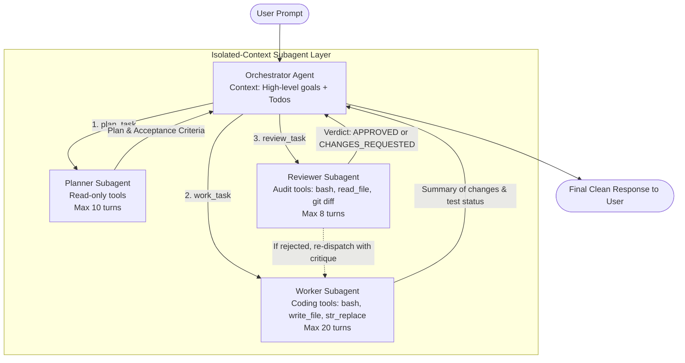

# Architecture & Implementation Plan: Multi-Agent Orchestration

This document outlines the design, architecture, and step-by-step implementation plan for adding **Planner**, **Worker**, and **Reviewer** subagents coordinated by a central **Orchestrator Agent**.

---

## 1. Executive Summary & Goals

### The Problem
When a single agent operates on complex, multi-file coding tasks:
- **Context Bloat**: Exploring dozens of files fills the context window quickly, triggering compaction early and losing fine-grained reasoning.
- **Thrashing**: The agent often acts as architect, coder, and tester simultaneously, leading to half-baked edits, premature completions, or loop thrashing.
- **Confirmation Bias**: The agent that wrote the bug is biased toward evaluating its own code as working.

### The Solution
A hierarchical multi-agent architecture where a main **Orchestrator** coordinates three specialized, isolated-context subagents:
1. **Planner Subagent**: Researches the codebase in an isolated context and outputs an architectural step-by-step plan and acceptance criteria.
2. **Worker Subagent**: Executes the plan in its own context, editing files and running builds/tests.
3. **Reviewer Subagent**: Inspects `git diff`, validates acceptance criteria, and issues a verdict (`APPROVED` or `CHANGES_REQUESTED` with diff feedback).

---

## 2. Architecture Diagram



---

## 3. Subagent Roles & Permissions Matrix

To enforce safety and prevent infinite recursion or shared-state corruption, each subagent receives a **structural tool whitelist**:

| Agent | Purpose | Allowed Tools | Structurally Withheld Tools | Max Turns |
| :--- | :--- | :--- | :--- | :--- |
| **Orchestrator** | High-level session manager, interacts with user, manages `<todos>`. | `plan_task`, `work_task`, `review_task`, `task`, `write_todos`, `bash` | None | Unlimited (compaction managed) |
| **Planner** | Explores codebase, traces call sites, identifies affected files, outputs blueprint. | `bash`, `read_file`, `read_skill`, `browser` | `write_file`, `str_replace`, `write_todos`, subagent tools | 10 |
| **Worker** | Follows plan, edits files, adds tests, runs build. | `write_file`, `str_replace`, `read_file`, `bash`, `read_skill` | `write_todos`, subagent tools | 20 |
| **Reviewer** | Compares `git diff` against acceptance criteria, checks edge cases, runs verification. | `bash`, `read_file`, `read_skill` | `write_file`, `str_replace`, `write_todos`, subagent tools | 8 |

---

## 4. Context Isolation & Cache Preservation

Following the prefix caching and output capping principles:

1. **"Nothing Goes In"**: Each subagent starts with exactly two messages:
   - Message 0: Dedicated system prompt for that role (`getPlannerPrompt()`, `getWorkerPrompt()`, etc.).
   - Message 1: The specific task description or plan passed from the Orchestrator.
2. **"Only the Answer Comes Back"**: The subagent's internal tool calls, outputs, and iterations stay in its private memory. Only the final synthesized result string returns to the Orchestrator.
3. **Prefix Cache Hit Rate**: Because the Orchestrator only records the prompt and the concise tool returns, its transcript stays tiny, guaranteeing prompt prefix cache hits across long turns.

---

## 5. Detailed Component Specifications

### 5.1 Core Subagent Engine: [`src/subagent.ts`](file:///d:/code/coding-harness/src/subagent.ts)
Refactor the subagent loop from [`src/tools/task.ts`](file:///d:/code/coding-harness/src/tools/task.ts) into a reusable engine:

```typescript
export interface SubagentConfig {
  role: "planner" | "worker" | "reviewer" | "researcher";
  taskDescription: string;
  systemPrompt: string;
  allowedTools: Tool[];
  maxTurns?: number;
  label?: string;
}

export async function runSubagent(config: SubagentConfig): Promise<string>;
```

### 5.2 The Three Orchestration Tools: [`src/tools/orchestrator.ts`](file:///d:/code/coding-harness/src/tools/orchestrator.ts)

#### 1. `plan_task`
- **Description**: "Dispatch an isolated Planner subagent to survey the codebase and generate a step-by-step implementation plan with acceptance criteria."
- **Parameters**: `{ "goal": string, "context"?: string }`

#### 2. `work_task`
- **Description**: "Dispatch an isolated Worker subagent to implement code changes according to a plan. Returns summary of changes and build/test status."
- **Parameters**: `{ "plan": string, "instructions"?: string }`

#### 3. `review_task`
- **Description**: "Dispatch an isolated Reviewer subagent to audit recent git diffs and test results against acceptance criteria. Returns APPROVED or CHANGES_REQUESTED with specific issues."
- **Parameters**: `{ "goal": string, "acceptance_criteria"?: string }`

---

## 6. Phased Implementation Roadmap

### Phase 1: Core Engine Refactoring (`src/subagent.ts`)
- Extract `runSubagent` from `src/tools/task.ts` into `src/subagent.ts`.
- Support role-based configuration (`systemPrompt`, `allowedTools`, `maxTurns`).
- Retain backward compatibility for the existing `task` research tool.

### Phase 2: Role Prompts & Tool Construction (`src/tools/orchestrator.ts`)
- Implement `PLANNER_SYSTEM_PROMPT`: focuses on finding files, identifying dependencies, writing numbered steps and testing requirements.
- Implement `WORKER_SYSTEM_PROMPT`: focuses on clean surgical edits with `str_replace` and `write_file`, running tests after edits.
- Implement `REVIEWER_SYSTEM_PROMPT`: focuses on `git diff` audit, edge cases, regression risks, and formatting verdicts as `APPROVED` or `CHANGES_REQUESTED`.
- Create and register `planTool`, `workTool`, `reviewTool`.

### Phase 3: Orchestrator Integration & System Prompt Updates
- Update `registeredTools` in `src/tools/index.ts` to include the orchestration tools.
- Update `getSystemPrompt()` in `src/config.ts` to instruct the orchestrator on when to use `plan_task`, `work_task`, and `review_task`.
- Add feedback loop: If `review_task` returns `CHANGES_REQUESTED`, orchestrator can invoke `work_task` with the critique.

### Phase 4: UI Enhancements (`src/ui.ts`)
- Add distinct role spinner labels:
  - `planner: analyzing codebase...`
  - `worker: applying changes...`
  - `reviewer: auditing diff...`
- Render distinct badge panels for review verdicts:
  - Green border panel for `REVIEW: APPROVED`
  - Yellow border panel for `REVIEW: CHANGES REQUESTED`

### Phase 5: Verification & End-to-End Testing
- Create automated unit tests in `test/test_orchestration.ts`.
- Run end-to-end task:
  `npm run dev -- "Implement a health check utility function with tests using planner, worker, and reviewer"`
- Verify token efficiency, turn separation, and review feedback loop.

---

## 7. Open Decisions for Confirmation

1. **Auto-Pipeline vs. Agentic Choice**:
   - **Option A (Agentic - Recommended)**: The Orchestrator has `plan_task`, `work_task`, `review_task` as tools, choosing dynamically based on complexity.
   - **Option B (Rigid Workflow)**: A single `/pipeline` slash command or flag that automatically forces `Planner -> Worker -> Reviewer` in sequence.
2. **Reviewer Loop Limit**:
   - Cap maximum review-rework cycles to 2 to prevent endless cycles on ambiguous requests.
